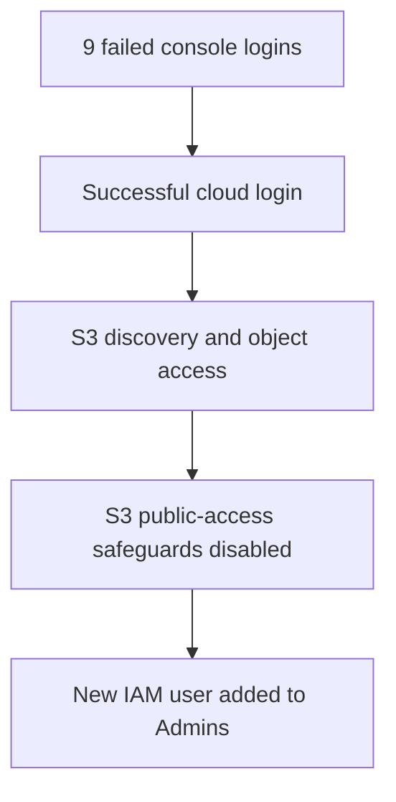
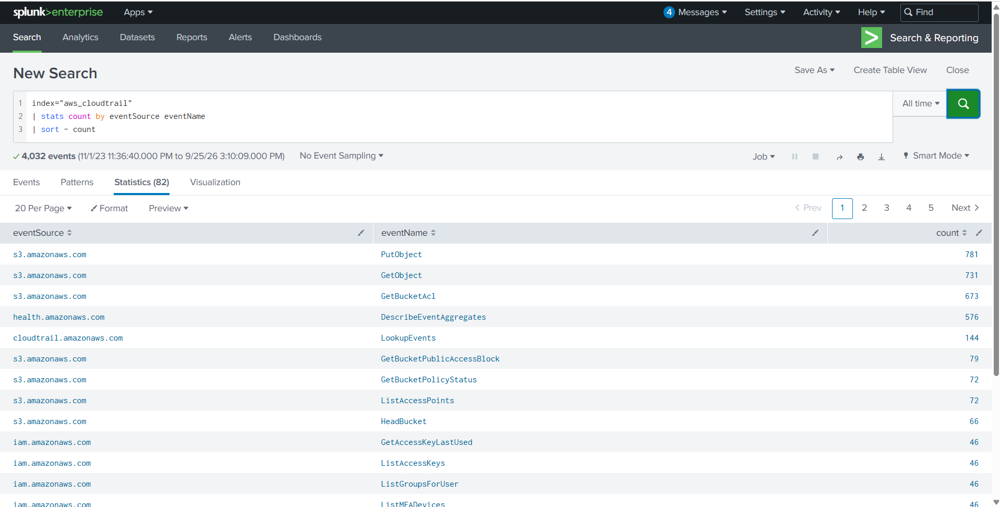
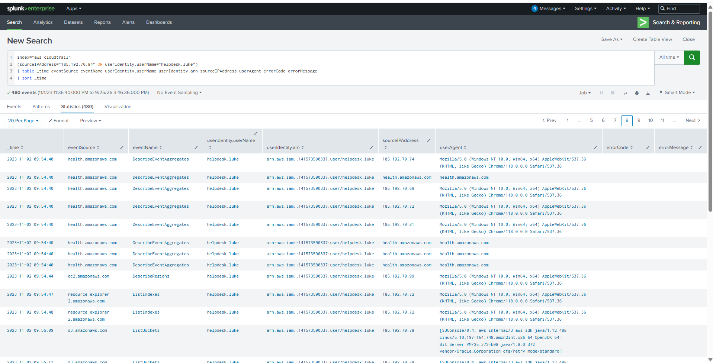
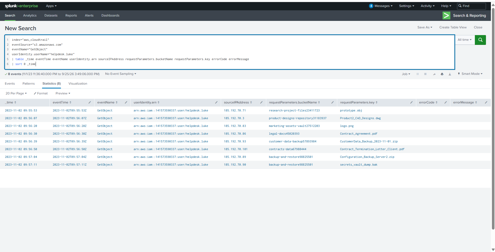

# AWSRaid — AWS CloudTrail Incident Investigation


## Overview

This write-up documents an investigation of suspicious activity in an AWS environment using CloudTrail data ingested into Splunk. The evidence shows a concentrated sequence of failed console logins followed by a successful login to an IAM user, S3 discovery and object access, a security-relevant change to an S3 bucket, and the creation of a second privileged IAM user.

The investigation was performed from the evidence outward: establish a baseline, isolate authentication activity, correlate the suspicious identity with later API calls, and verify each finding through the relevant CloudTrail fields.

> All timestamps in this write-up are presented in UTC. This is a training-lab investigation; the conclusions below are limited to the supplied CloudTrail dataset.

## Full Report

[Download the complete AWSRaid CloudTrail Investigation Report (PDF)](./AWSRaid-CloudTrail-Investigation-Report.pdf)

## Investigation Objectives

- Identify the compromised IAM user.
- Determine the time of the first S3 object access after compromise.
- Identify the bucket containing the accessed DWG file.
- Identify the S3 bucket whose public-access safeguards were changed.
- Identify the IAM user created by the attacker.
- Identify the group to which the new user was added.
- Reconstruct the sequence of events and map it to MITRE ATT&CK.

## Tools and Data

| Item | Value |
|---|---|
| Primary evidence | AWS CloudTrail events |
| Splunk index | `aws_cloudtrail` |
| Total events | `4,032` |
| Primary analysis tool | Splunk Enterprise |
| Compromised identity | `helpdesk.luke` |
| Main suspicious login IP | `185.192.70.84` |

## Investigation Methodology

The investigation followed a broad-to-narrow workflow:

1. Review the dataset and count events by AWS service.
2. Isolate AWS console sign-in events.
3. Aggregate failed logins by username and source IP.
4. Confirm whether a successful login followed the failures.
5. Pivot from the compromised username into all subsequent CloudTrail activity.
6. Review S3 enumeration, object access, and security-configuration changes.
7. Review IAM account creation and group membership changes.
8. Build a verified event timeline and assess impact.



## 1. Initial CloudTrail Triage

The following query counted the number of events generated by each AWS service:

```spl
index="aws_cloudtrail"
| stats count by eventSource
| sort - count
```



The result contained 23 event sources. Amazon S3 was the most active service with `2,702` events, followed by AWS Health, IAM, and CloudTrail. High volume alone does not prove malicious activity, but it identifies the services that deserve focused review.

## 2. Compromised Account Identification

Console authentication events were reviewed chronologically:

```spl
index="aws_cloudtrail" eventSource="signin.amazonaws.com"
| table _time eventName userIdentity.arn userIdentity.userName sourceIPAddress userAgent "responseElements.ConsoleLogin" errorMessage
| sort 0 _time
```

Failed logins were then aggregated by username and source IP:

```spl
index="aws_cloudtrail"
eventSource="signin.amazonaws.com"
"responseElements.ConsoleLogin"="Failure"
| stats count AS failed_attempts
        min(_time) AS first_seen
        max(_time) AS last_seen
        values(userAgent) AS user_agents
        by userIdentity.userName sourceIPAddress
| convert ctime(first_seen) ctime(last_seen)
| sort - failed_attempts
```


The strongest anomaly involved `helpdesk.luke` from `185.192.70.84`:

| Observation | Evidence |
|---|---|
| Failed attempts | `9` |
| First failure | `2023-11-02 09:53:27 UTC` |
| Last failure | `2023-11-02 09:54:00 UTC` |
| Successful login | `2023-11-02 09:54:04 UTC` |
| Time from last failure to success | `4 seconds` |
| User agent | Windows 10 / Chrome 118 |


Nine failures in 33 seconds followed immediately by a successful login are strongly indicative of password guessing or the use of newly obtained credentials. CloudTrail proves the authentication sequence; it does not, by itself, reveal the exact source of the correct password.

**Finding:** the compromised user was `helpdesk.luke`.

## 3. Scoping the Compromised Identity

The following pivot searched for activity tied either to the original suspicious IP or to the compromised username:

```spl
index="aws_cloudtrail"
(sourceIPAddress="185.192.70.84" OR userIdentity.userName="helpdesk.luke")
| table _time eventSource eventName userIdentity.userName userIdentity.arn sourceIPAddress userAgent errorCode errorMessage
| sort 0 _time
```

This returned `480` events. After the successful login, the identity appeared from multiple addresses in the `185.192.70.x` range. The close timing, common account ARN, and consistent client characteristics suggest rotating infrastructure or a proxy pool; this is an analytical inference, not a fact established by CloudTrail alone. Entries where `sourceIPAddress` is an AWS service hostname should be treated as service-originated calls rather than additional attacker IPs.

## 4. S3 Discovery and First Object Access

The first S3 action attributed to the compromised user was `ListBuckets` at `2023-11-02 09:55:09 UTC`:

```spl
index="aws_cloudtrail"
eventSource="s3.amazonaws.com"
eventName="ListBuckets"
userIdentity.userName="helpdesk.luke"
| table _time eventTime eventName userIdentity.arn sourceIPAddress userAgent errorCode errorMessage
| sort 0 _time
```



`ListBuckets` is an enumeration action. It identifies available storage but is not an access to a specific object. To answer when the attacker first accessed an object, the investigation must use `GetObject` events:

```spl
index="aws_cloudtrail"
eventSource="s3.amazonaws.com"
eventName="GetObject"
userIdentity.userName="helpdesk.luke"
| table _time eventTime eventName userIdentity.arn sourceIPAddress requestParameters.bucketName requestParameters.key errorCode errorMessage
| sort 0 _time
```



The earliest successful `GetObject` event occurred at `2023-11-02 09:55:53 UTC`, which is submitted in the lab's requested minute format as:

```text
2023-11-02 09:55
```

The event accessed `prototype.obj` from `research-project-files23411723`.

## 5. Accessed S3 Objects

The compromised account retrieved eight objects in approximately 78 seconds:

| Time (UTC) | Bucket | Object key |
|---|---|---|
| 09:55:53 | `research-project-files23411723` | `prototype.obj` |
| 09:56:07 | `product-designs-repository31183937` | `Product2_CAD_Designs.dwg` |
| 09:56:20 | `marketing-assets-vault27512203` | `logo.png` |
| 09:56:30 | `legal-docs45020393` | `Contract_Agreement.pdf` |
| 09:56:39 | `customer-data-backup57893984` | `CustomerData_Backup_2023-11-01.zip` |
| 09:56:50 | `contracts-data67988444` | `Contract_Termination_Letter_Client.pdf` |
| 09:57:04 | `backup-and-restore98825501` | `Configuration_Backup_Server2.zip` |
| 09:57:11 | `backup-and-restore98825501` | `secrets_vault_dump.bak` |

A `.dwg` file is an AutoCAD drawing file commonly used for engineering, product-design, or architectural data. The targeted query below isolates that access:

```spl
index="aws_cloudtrail"
eventSource="s3.amazonaws.com"
eventName="GetObject"
userIdentity.userName="helpdesk.luke"
requestParameters.key="*.dwg"
| table _time requestParameters.bucketName requestParameters.key sourceIPAddress
```

**Finding:** the DWG file was stored in `product-designs-repository31183937`.

## 6. S3 Public-Access Safeguards Modified

Security-relevant S3 configuration events were isolated with:

```spl
index="aws_cloudtrail"
eventSource="s3.amazonaws.com"
userIdentity.userName="helpdesk.luke"
(eventName="PutBucketPublicAccessBlock" OR eventName="DeletePublicAccessBlock" OR eventName="PutBucketAcl" OR eventName="PutBucketPolicy")
| table _time eventName userIdentity.arn sourceIPAddress requestParameters.bucketName requestParameters errorCode errorMessage
| sort 0 _time
```


At `2023-11-02 09:58:01 UTC`, the compromised account issued `PutBucketPublicAccessBlock` against `backup-and-restore98825501`. The raw request set all four safeguards to `false`:

```text
BlockPublicAcls:       false
BlockPublicPolicy:     false
IgnorePublicAcls:      false
RestrictPublicBuckets: false
```

The event had `readOnly: false`, `managementEvent: true`, and no error code, confirming a successful configuration change.

Important nuance: disabling these safeguards allows a public ACL or bucket policy to take effect, but this event alone does not prove that every object became publicly accessible. Confirmation of actual anonymous access would require the effective bucket policy, ACL, account-level controls, or access logs.

**Finding:** the affected bucket was `backup-and-restore98825501`.

## 7. Persistence Through IAM User Creation

The compromised identity created another IAM user:

```spl
index="aws_cloudtrail"
eventSource="iam.amazonaws.com"
userIdentity.userName="helpdesk.luke"
eventName="CreateUser"
| table _time eventName userIdentity.arn sourceIPAddress requestParameters.userName responseElements.user.arn errorCode errorMessage
| sort 0 _time
```


At `2023-11-02 09:59:33 UTC`, `helpdesk.luke` created `marketing.mark`. The returned user ARN and absence of an error confirm success.

**Finding:** the attacker-created account was `marketing.mark`.

## 8. Privileged Group Membership

Five seconds after account creation, the new user was added to a group:

```spl
index="aws_cloudtrail"
eventSource="iam.amazonaws.com"
eventName="AddUserToGroup"
requestParameters.userName="marketing.mark"
| table _time eventName userIdentity.arn sourceIPAddress requestParameters.userName requestParameters.groupName errorCode errorMessage
| sort 0 _time
```


At `2023-11-02 09:59:38 UTC`, `marketing.mark` was added to `Admins`. This action provided a secondary account for persistence and likely elevated access.

**Finding:** the group was `Admins`.

## Reconstructed Timeline

| Time (UTC) | Event | Interpretation |
|---|---|---|
| 09:53:27–09:54:00 | 9 failed `ConsoleLogin` attempts | Suspected password guessing against `helpdesk.luke` |
| 09:54:04 | Successful `ConsoleLogin` | Compromised credentials used successfully |
| 09:55:09 | `ListBuckets` | S3 discovery begins |
| 09:55:53 | First `GetObject` | First confirmed object access |
| 09:56:07 | DWG file retrieved | Product-design data accessed |
| 09:57:11 | `secrets_vault_dump.bak` retrieved | Sensitive backup material accessed |
| 09:58:01 | `PutBucketPublicAccessBlock` | Four bucket-level safeguards set to `false` |
| 09:59:33 | `CreateUser` | `marketing.mark` created |
| 09:59:38 | `AddUserToGroup` | New user added to `Admins` |

The interval from successful login to privileged persistence was only **5 minutes and 34 seconds**.

## Key Findings

| Question | Finding |
|---|---|
| Compromised user | `helpdesk.luke` |
| First S3 object access | `2023-11-02 09:55 UTC` |
| Bucket containing the DWG file | `product-designs-repository31183937` |
| Bucket with modified public-access safeguards | `backup-and-restore98825501` |
| Attacker-created user | `marketing.mark` |
| Group assigned to the new user | `Admins` |

## Indicators of Compromise

| Type | Indicator |
|---|---|
| Compromised identity | `helpdesk.luke` |
| Primary login IP | `185.192.70.84` |
| Related observed range | `185.192.70.x` |
| Persistence account | `marketing.mark` |
| Privileged group | `Admins` |
| Modified bucket | `backup-and-restore98825501` |
| Sensitive object | `secrets_vault_dump.bak` |
| Product-design object | `Product2_CAD_Designs.dwg` |

## MITRE ATT&CK Mapping

| Tactic | Technique | Evidence |
|---|---|---|
| Credential Access | `T1110.001 — Password Guessing` | Nine failed logins followed by a success; exact credential source remains unconfirmed |
| Initial Access / Persistence | `T1078.004 — Valid Accounts: Cloud Accounts` | Successful AWS console use of `helpdesk.luke` |
| Discovery | `T1619 — Cloud Storage Object Discovery` | `ListBuckets` and subsequent S3 exploration |
| Collection | `T1530 — Data from Cloud Storage` | Eight successful `GetObject` operations |
| Persistence | `T1136.003 — Create Account: Cloud Account` | Creation of `marketing.mark` |
| Persistence / Privilege Escalation | `T1098.003 — Additional Cloud Roles` | New account added to `Admins` |

## Detection Opportunities

- Alert when multiple `ConsoleLogin` failures for one user are followed by a success within a short interval.
- Correlate a successful login with immediate use of S3 discovery APIs such as `ListBuckets`.
- Detect bursts of `GetObject` across multiple buckets, especially from new IP ranges or unusual user agents.
- Alert when any S3 Block Public Access field is set to `false`.
- Treat `CreateUser` followed shortly by `AddUserToGroup` as high-priority persistence behavior.
- Flag newly created users added to privileged groups such as `Admins`.
- Baseline source IPs and user agents for console and programmatic activity; investigate sudden changes.
- Alert on access to backup, secret, contract, customer-data, and design-file patterns.

## Remediation Recommendations

1. Disable `helpdesk.luke`, revoke active sessions, and rotate all associated credentials.
2. Remove `marketing.mark` and review every IAM change made during the incident window.
3. Remove unauthorized group memberships, policies, access keys, login profiles, and tokens.
4. Restore S3 Block Public Access controls at the account and bucket levels.
5. Review effective ACLs and policies for `backup-and-restore98825501` and verify whether anonymous access occurred.
6. Investigate all objects accessed by the compromised account and assess data sensitivity.
7. Enable strong MFA and enforce least privilege for IAM identities.
8. Add detections for rapid login failures followed by success and for suspicious IAM/S3 changes.
9. Preserve CloudTrail, S3 access logs, IAM credential reports, and related evidence for incident response.
10. Review whether the accessed backup and secret files require credential or key rotation.

## Conclusion

The CloudTrail evidence supports a coherent compromise chain: rapid failed console authentication, successful access to `helpdesk.luke`, immediate S3 discovery, retrieval of eight objects, weakening of S3 public-access safeguards, and creation of a new user with privileged group membership.

The most important analytical distinction was separating discovery (`ListBuckets`) from confirmed object access (`GetObject`). Correlating identity, event name, timestamp, request parameters, response fields, source IP, and error fields produced an evidence-based timeline rather than relying on event volume alone.

## References

- [CyberDefenders — AWSRaid](https://cyberdefenders.org/blueteam-ctf-challenges/awsraid/)
- [AWS — What is CloudTrail?](https://docs.aws.amazon.com/awscloudtrail/latest/userguide/)
- [AWS — Understanding CloudTrail events](https://docs.aws.amazon.com/awscloudtrail/latest/userguide/cloudtrail-events.html)
- [AWS — Logging Amazon S3 API calls using CloudTrail](https://docs.aws.amazon.com/AmazonS3/latest/userguide/cloudtrail-logging.html)
- [AWS — Blocking public access to S3 storage](https://docs.aws.amazon.com/AmazonS3/latest/userguide/access-control-block-public-access.html)
- [AWS IAM API — CreateUser](https://docs.aws.amazon.com/IAM/latest/APIReference/API_CreateUser.html)
- [AWS IAM API — AddUserToGroup](https://docs.aws.amazon.com/IAM/latest/APIReference/API_AddUserToGroup.html)
- [MITRE ATT&CK — Password Guessing](https://attack.mitre.org/techniques/T1110/001/)
- [MITRE ATT&CK — Valid Accounts: Cloud Accounts](https://attack.mitre.org/techniques/T1078/004/)
- [MITRE ATT&CK — Cloud Storage Object Discovery](https://attack.mitre.org/techniques/T1619/)
- [MITRE ATT&CK — Data from Cloud Storage](https://attack.mitre.org/techniques/T1530/)
- [MITRE ATT&CK — Create Account: Cloud Account](https://attack.mitre.org/techniques/T1136/003/)
- [MITRE ATT&CK — Additional Cloud Roles](https://attack.mitre.org/techniques/T1098/003/)

---

**Author:** Alaa Zahra  
**Track:** SOC Analyst / Cloud Forensics  
**Platform:** CyberDefenders
