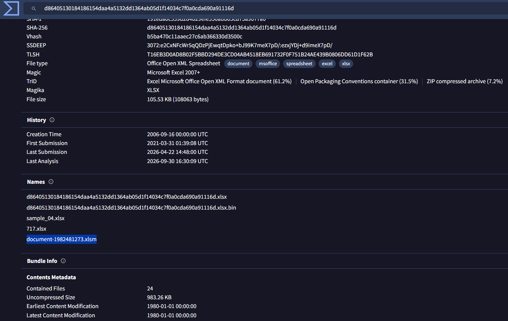
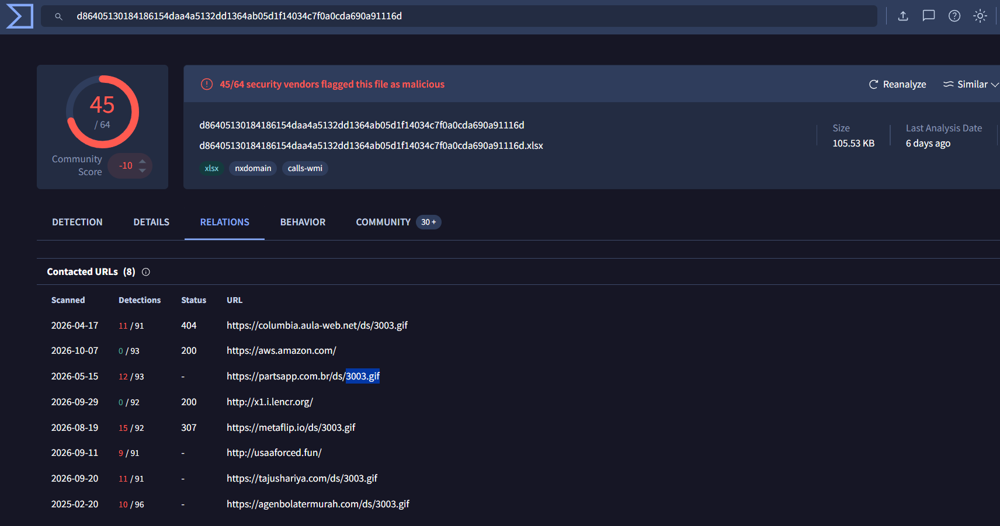
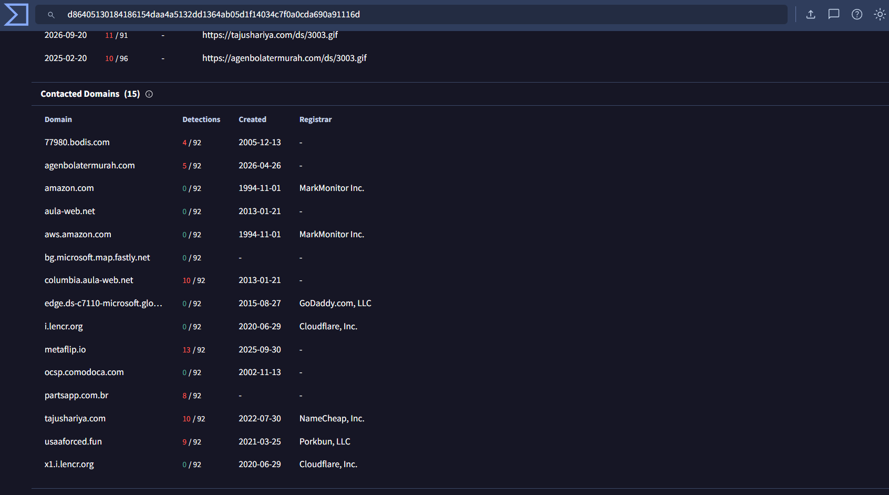
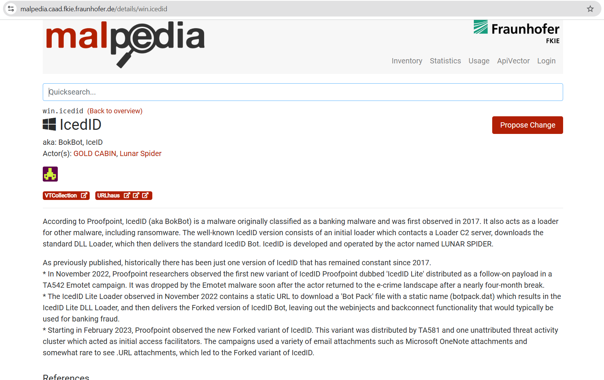
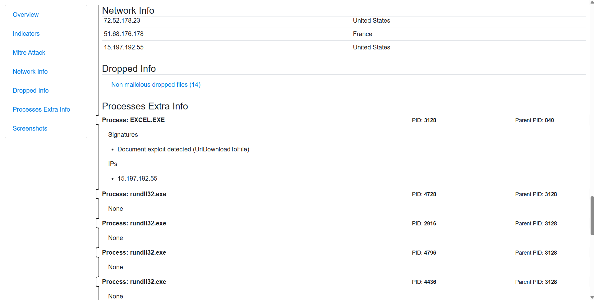
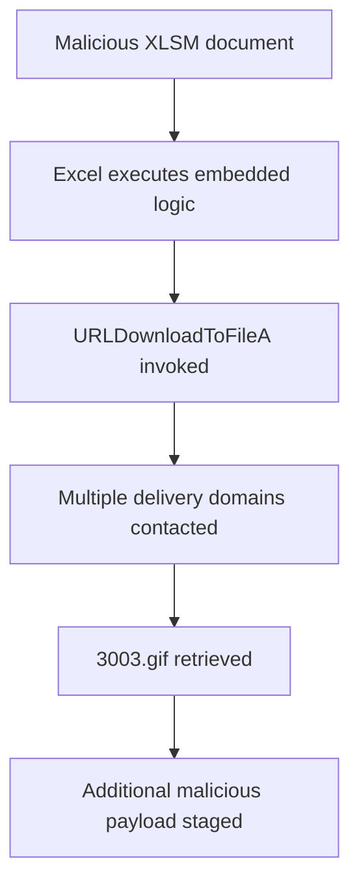

# IcedID Malware Intelligence Investigation

## Overview

This investigation analyzes an IcedID-related malicious Microsoft Excel document using its cryptographic hash. The objective was to enrich the sample with threat-intelligence and sandbox evidence, reconstruct its payload-retrieval behavior, identify associated infrastructure, and connect the activity to a known threat cluster.

The analysis began with the supplied SHA-1 hash and followed an evidence-led workflow: validate the sample, identify its original filename, inspect related network artifacts, investigate the domains involved in payload delivery, verify threat-actor attribution through a malware intelligence source, and confirm the Windows API used during execution.

> This write-up documents an authorized CyberDefenders training exercise. No malware sample was executed on the host system.

## Investigation Scope

| Item | Value |
|---|---|
| Analysis type | Static enrichment and sandbox-behavior review |
| Initial indicator | SHA-1 hash supplied by the lab |
| Malware family | IcedID |
| Primary tools | VirusTotal, Malpedia, sandbox behavior reports, WHOIS data |
| Main objective | Reconstruct the payload-delivery activity and related threat intelligence |

## Investigation Methodology

The investigation followed this sequence:

1. Search the supplied hash in VirusTotal.
2. Confirm the sample identity from its metadata and historical filenames.
3. Inspect the sample's relations to identify downloaded payload URLs.
4. Count the distinct domains involved in hosting the additional payload.
5. review domain registration data to identify the registrar.
6. Cross-reference the malware family with Malpedia to identify associated threat actors.
7. Review sandbox behavior to determine which Windows API retrieved additional payloads.

## Evidence and Findings

### 1. Sample validation and original filename

VirusTotal identified the submitted object as a malicious macro-enabled Microsoft Excel workbook. The Details view associated the sample with the original filename `document-1982481273.xlsm`.

**Finding:** The analyzed file was `document-1982481273.xlsm`.

The `.xlsm` extension is important because it indicates an Excel workbook capable of containing VBA macros. Macro-enabled documents are frequently used as initial-stage downloaders, although the extension alone does not prove malicious behavior.

### 2. Additional payload identification

The VirusTotal Relations view showed URLs connected to the malicious document. Multiple URLs ended with the same apparent image filename: `3003.gif`.

**Finding:** The additional payload used the filename `3003.gif`.

Although the `.gif` extension suggests an image, file extensions cannot be trusted as proof of content. Threat actors commonly use misleading extensions to disguise executable or DLL payloads.

### 3. Payload-hosting infrastructure

The connected URLs showed that the document attempted to retrieve the same payload from five distinct domains. Using several hosts provides redundancy: the infection chain may continue even if one delivery domain becomes unavailable.

**Finding:** Five domains were used as candidate download locations for the additional payload.

### 4. Domain registrar investigation

Registration information for the relevant `.com` infrastructure showed `NameCheap, Inc.` as the registrar.

**Finding:** The registrar was `NameCheap`.

Registrar information describes where a domain was registered. It does not, by itself, prove that the registrar participated in or had knowledge of the malicious activity.

### 5. Threat-cluster attribution

Malpedia's IcedID entry listed several actors associated with the malware family, including `GOLD CABIN`. This provided a threat-intelligence link between the sample's malware family and the cluster requested by the investigation.

**Finding:** The threat actor associated with the sample was `GOLD CABIN`.

This is intelligence-based attribution, not proof of a specific individual's identity. Malware families can be shared, sold, or used by more than one criminal group.

### 6. Payload-retrieval function

Sandbox behavior tied the suspicious activity to `EXCEL.EXE` and detected use of the `UrlDownloadToFile` family. The execution-specific API variant used by the sample was `URLDownloadToFileA`.

**Finding:** The malware used `URLDownloadToFileA` to retrieve additional payloads.

`URLDownloadToFileA` is a Windows API that downloads data from a URL and writes it to a local file. The `A` suffix identifies the ANSI-string version of the function; the corresponding Unicode version ends in `W`.

## Reconstructed Activity

The document acted as the initial delivery component. Once opened and allowed to execute its embedded logic, it attempted to retrieve a second-stage object named `3003.gif` from multiple domains. Sandbox evidence associated the retrieval with the Windows `URLDownloadToFileA` API.

## Indicators of Compromise

| Type | Indicator | Context |
|---|---|---|
| Filename | `document-1982481273.xlsm` | Initial malicious Excel document |
| Filename | `3003.gif` | Disguised additional payload |
| Malware family | `IcedID` | Malware classification |
| Threat cluster | `GOLD CABIN` | Intelligence association |
| API | `URLDownloadToFileA` | Payload retrieval |

The domains and IP addresses visible in historical sandbox reports should be validated against current intelligence before blocking. Infrastructure may expire, change ownership, or host unrelated content later.

## MITRE ATT&CK Mapping

| Technique | ID | Evidence |
|---|---|---|
| Phishing Attachment | T1566.001 | Malicious macro-enabled Excel workbook used as the initial file |
| User Execution Malicious File | T1204.002 | The document requires execution through Microsoft Excel |
| Ingress Tool Transfer | T1105 | Additional payload retrieved from remote infrastructure |
| Masquerading | T1036 | Payload presented with a `.gif` filename despite malicious behavior |
| Application Layer Protocol Web Protocols | T1071.001 | Payload retrieval over web URLs |

The mapping is based on the observed behavior and the supplied lab context. A technique is included only where the evidence supports the behavior; it does not imply that every IcedID campaign follows the same chain.

## Detection Opportunities

- Alert when Office applications initiate outbound connections to newly observed or low-reputation domains.
- Detect Office processes calling download-related APIs or spawning script interpreters and LOLBins.
- Inspect files whose extension does not match their actual content type.
- Hunt for repeated requests for the same payload filename across several unrelated domains.
- Correlate email attachment telemetry, Office process activity, DNS queries, HTTP requests, and newly written files.
- Block or restrict macros originating from the internet and use Attack Surface Reduction rules where appropriate.

## Remediation Recommendations

1. Isolate any endpoint that opened the workbook and preserve volatile evidence.
2. Quarantine the initial document and all retrieved artifacts.
3. Search enterprise telemetry for the identified filenames, hashes, domains, URLs, and related process activity.
4. Block confirmed malicious infrastructure at DNS, proxy, firewall, and endpoint layers.
5. Review persistence, credential access, and lateral-movement evidence before returning the host to service.
6. Reset credentials if post-exploitation activity indicates possible theft.
7. Strengthen Office macro controls and attachment sandboxing.

## Answers Summary

| Question | Finding |
|---|---|
| File associated with the supplied hash | `document-1982481273.xlsm` |
| Deployed GIF filename | `3003.gif` |
| Number of payload-hosting domains | `5` |
| Registrar used for the `.com` domain | `NameCheap` |
| Associated threat actor | `GOLD CABIN` |
| Function used to fetch additional payloads | `URLDownloadToFileA` |

## Key Lessons

- A hash is a pivot point, not a conclusion. It connects the investigator to metadata, relationships, behavior, and community intelligence.
- File extensions are labels and may be deliberately misleading.
- One sandbox may miss behavior that another captures; cross-validation is often necessary.
- Attribution must be stated carefully. An intelligence association is not proof of the operator's real-world identity.
- Every conclusion in a report should be tied to a visible field, behavioral event, or trusted intelligence source.

## Disclaimer

This repository is intended for defensive-security education. The investigation was performed in an authorized training environment using public threat-intelligence and sandbox reports.

---

**Author:** Alaa Zahra  
**Track:** SOC Analysis and Malware Investigation
