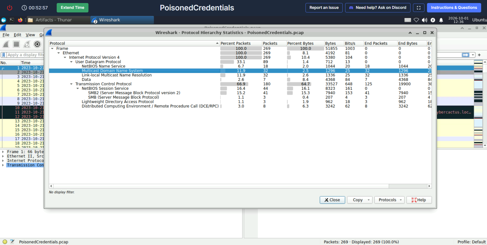
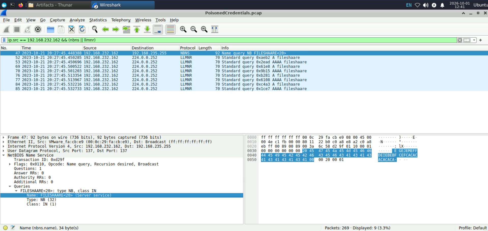
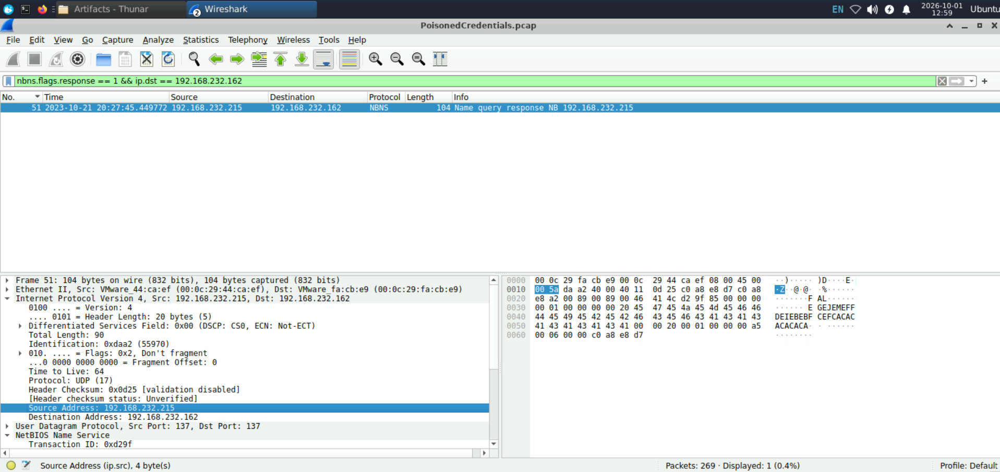
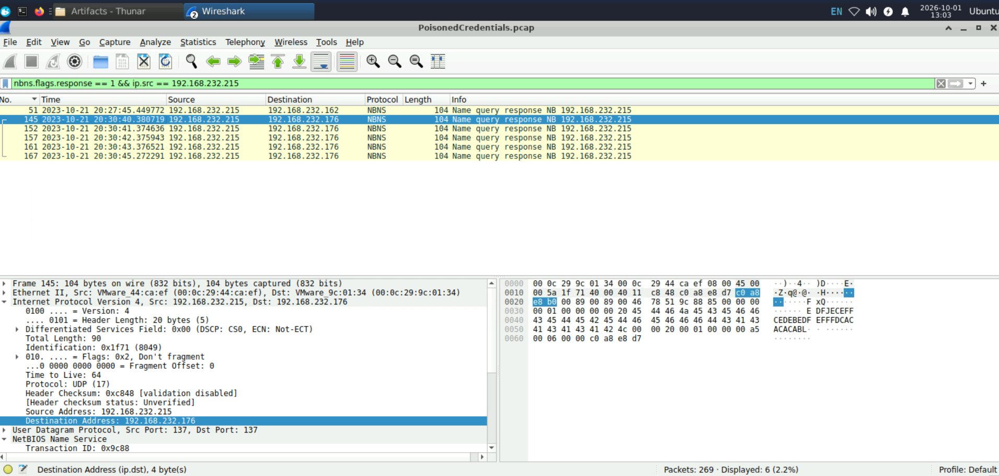
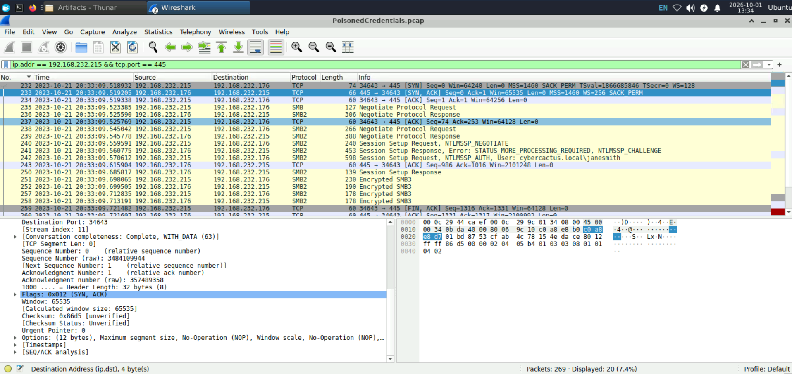
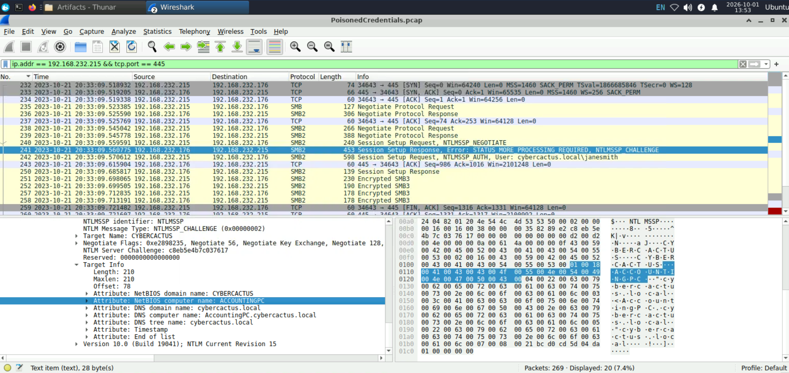

# PoisonedCredentials — Network Forensics Investigation


## Overview

This write-up documents the investigation of a local-network name-resolution poisoning incident captured in `PoisonedCredentials.pcap`.

The evidence shows that a rogue host answered NBNS requests for a mistyped file-share name, poisoned more than one workstation, and later initiated an SMB session to an internal target while authenticating as the compromised domain user `janesmith`.

> All timestamps are presented as displayed in Wireshark. The PCAP demonstrates credential use during NTLM authentication, but it does not expose a plaintext password or prove the exact method by which the credential was obtained.

## Full Investigation Report

[Download the complete PoisonedCredentials Network Forensics Report](./PoisonedCredentials-Network-Forensics-Report.pdf)

## Investigation Objectives

- Identify the mistyped name that triggered fallback name resolution.
- Determine which host sent the forged NBNS response.
- Identify additional systems affected by the poisoning activity.
- Recover the username used in the later NTLM authentication.
- Identify the SMB target hostname.
- Reconstruct the attack sequence and document detection opportunities.

## Tools and Evidence

| Item | Details |
|---|---|
| Evidence | `PoisonedCredentials.pcap` |
| Packet count | `269` |
| Primary tool | Wireshark |
| Relevant protocols | NBNS, LLMNR, TCP, SMB2, NTLMSSP |
| Analysis focus | Name-resolution poisoning and SMB authentication |

## Executive Summary

The investigation began with protocol-level triage. The capture contained NBNS and LLMNR traffic, both of which are used as fallback name-resolution mechanisms on Windows networks. These protocols are valuable during incident response because an unauthorized host can answer unresolved-name queries and redirect victims to itself.

The host `192.168.232.162` queried the misspelled NetBIOS name `FILESHAARE<20>`. The address `192.168.232.215` immediately returned an NBNS response claiming ownership of that name. The same responder also sent poisoned replies to `192.168.232.176`, demonstrating that the activity affected more than the initially supplied endpoint.

Later, `192.168.232.215` initiated an SMB connection to `192.168.232.176` over TCP port `445`. The NTLM authentication exchange identified the account `cybercactus.local\janesmith`, while the server challenge identified the SMB target as `AccountingPC.cybercactus.local`.

## Key Findings

| Finding | Value |
|---|---|
| Mistyped query | `FILESHAARE` |
| Rogue responder | `192.168.232.215` |
| Initially observed victim | `192.168.232.162` |
| Additional poisoned host | `192.168.232.176` |
| Compromised user | `cybercactus.local\janesmith` |
| SMB target | `AccountingPC.cybercactus.local` |
| SMB port | `445/TCP` |

## Investigation Methodology

### 1. Establish the protocol baseline

The first step was to inspect **Statistics → Protocol Hierarchy**. This avoids guessing an attack type too early and reveals which protocols deserve attention.

The PCAP contained `269` packets and included NBNS, LLMNR, NetBIOS Session Service, SMB, and SMB2 traffic. The combination of fallback name resolution and SMB made name-resolution poisoning a strong investigation path.



### 2. Identify the query that triggered the incident

Traffic from the initially supplied workstation was isolated with:

```wireshark
ip.src == 192.168.232.162 && (nbns || llmnr)
```

The filter revealed requests for the misspelled name:

```text
FILESHAARE<20>
```

`<20>` is the NetBIOS suffix associated with the file-server service. The spelling contains an extra `A`, so normal name resolution could not find the intended host and fallback resolution was triggered.

The LLMNR requests were sent to the IPv4 multicast address `224.0.0.252`, while the NBNS request was sent using subnet broadcast on UDP port `137`.



**Answer:** `FILESHAARE`

### 3. Identify the rogue NBNS responder

Only NBNS responses destined for the initial victim were displayed:

```wireshark
nbns.flags.response == 1 && ip.dst == 192.168.232.162
```

The response originated from `192.168.232.215` and claimed that `FILESHAARE<20>` resolved to the responder's own address. The timing and false claim identify this host as the rogue responder.



**Answer:** `192.168.232.215`

### 4. Determine whether another host was poisoned

The scope was expanded from one destination to every response sent by the rogue system:

```wireshark
nbns.flags.response == 1 && ip.src == 192.168.232.215
```

This exposed forged responses to two destinations:

- `192.168.232.162`
- `192.168.232.176`

The second affected machine was therefore `192.168.232.176`. This step is important in a real incident because investigating only the initially reported endpoint can underestimate the blast radius.



**Answer:** `192.168.232.176`

### 5. Correlate the rogue host with SMB authentication

The next step was to inspect SMB traffic involving the rogue host:

```wireshark
ip.addr == 192.168.232.215 && tcp.port == 445
```

The packet sequence showed:

1. `192.168.232.215` initiated a TCP connection to `192.168.232.176:445`.
2. SMB dialect negotiation completed.
3. An `NTLMSSP_NEGOTIATE` message was sent.
4. The target returned an `NTLMSSP_CHALLENGE`.
5. `192.168.232.215` sent an `NTLMSSP_AUTH` message containing the identity `cybercactus.local\janesmith`.
6. Encrypted SMB3 traffic followed the session setup.

The relevant authentication packet was frame `242`.



**Answer:** `janesmith`

#### Why the username appears in a packet sent by the attacker

The username appears in the client-to-server `NTLMSSP_AUTH` message. In this later SMB connection, `192.168.232.215` is the SMB client and `192.168.232.176` is the server. Therefore, the rogue host sends the authentication identity to the target.

This proves that the account was used in the SMB authentication exchange. It does not, by itself, prove whether the attacker cracked a captured hash, relayed authentication, reused a hash, or obtained credentials through another method.

### 6. Identify the SMB target hostname

The `NTLMSSP_CHALLENGE` packet returned by `192.168.232.176` contained the server's target information:

```text
NetBIOS computer name: ACCOUNTINGPC
DNS computer name: AccountingPC.cybercactus.local
```

The full hostname of the accessed machine was therefore `AccountingPC.cybercactus.local`.



**Answer:** `AccountingPC`

## Reconstructed Attack Timeline

| Time | Event | Evidence |
|---|---|---|
| `2023-10-21 20:27:45.448` | Initial workstation queries `FILESHAARE<20>` | NBNS query from `192.168.232.162` |
| `2023-10-21 20:27:45.449` | Rogue host claims the requested name | NBNS response from `192.168.232.215` |
| `2023-10-21 20:30:40.380` | Additional victim receives a poisoned response | NBNS response to `192.168.232.176` |
| `2023-10-21 20:33:09.518` | Rogue host initiates SMB to the second victim | TCP SYN from `.215` to `.176:445` |
| `2023-10-21 20:33:09.570` | Compromised identity is submitted | NTLMSSP authentication as `janesmith` |
| `2023-10-21 20:33:09.698` | SMB session setup completes and SMB3 traffic follows | Session response and encrypted SMB3 frames |

## Attack Chain

1. A workstation attempted to resolve the misspelled file-share name `FILESHAARE`.
2. Normal name resolution failed, causing NBNS and LLMNR fallback traffic.
3. The rogue host `192.168.232.215` answered the NBNS query with its own address.
4. The same host sent poisoned responses to more than one internal workstation.
5. The rogue host later opened an SMB connection to `192.168.232.176`.
6. The connection authenticated as `cybercactus.local\janesmith`.
7. The NTLM challenge identified the destination as `AccountingPC.cybercactus.local`.

## Indicators of Compromise

| Type | Indicator |
|---|---|
| Rogue IP | `192.168.232.215` |
| Initial victim | `192.168.232.162` |
| Additional poisoned host / SMB target IP | `192.168.232.176` |
| Compromised identity | `cybercactus.local\janesmith` |
| SMB target hostname | `AccountingPC.cybercactus.local` |
| Suspicious queried name | `FILESHAARE<20>` |
| Protocols | NBNS `137/UDP`, LLMNR `5355/UDP`, SMB `445/TCP` |

## MITRE ATT&CK Mapping

| Tactic | Technique | Evidence |
|---|---|---|
| Credential Access / Collection | `T1557.001 — LLMNR/NBT-NS Poisoning and SMB Relay` | Forged NBNS responses redirected unresolved-name traffic to the rogue host |
| Defense Evasion / Persistence / Privilege Escalation / Initial Access | `T1078 — Valid Accounts` | The identity `cybercactus.local\janesmith` was used during NTLM authentication |
| Lateral Movement | `T1021.002 — SMB/Windows Admin Shares` | The rogue host initiated an SMB session to the internal target over TCP `445` |

> The packet capture does not provide enough evidence to map credential cracking or pass-the-hash with confidence, so those techniques are not asserted here.

## Detection Opportunities

- Alert when one endpoint answers NBNS or LLMNR queries for many unrelated names or destinations.
- Correlate fallback name-resolution requests with immediate connections to SMB, HTTP, or other authentication-capable services.
- Detect internal hosts unexpectedly acting as NBNS responders.
- Monitor NTLM authentications where a user authenticates from a new internal source.
- Alert on SMB connections from workstations that do not normally administer or access the destination.
- Hunt for rapid `NEGOTIATE → CHALLENGE → AUTHENTICATE` sequences involving a suspected poisoning host.

## Remediation Recommendations

1. Disable LLMNR through Group Policy where operationally possible.
2. Disable NetBIOS over TCP/IP when it is not required.
3. Enforce SMB signing to reduce relay opportunities.
4. Restrict or phase out NTLM in favor of Kerberos.
5. Limit inbound SMB access using host firewalls and network segmentation.
6. Reset the affected user's password and invalidate active sessions.
7. Investigate `192.168.232.215` for poisoning tools, captured challenge-response material, and follow-on activity.
8. Review `AccountingPC` for unauthorized file access, remote administration, and persistence.
9. Educate users to verify unexpected credential prompts and mistyped network paths.

## Conclusion

The investigation confirmed a name-resolution poisoning incident centered on `192.168.232.215`. A typo in a file-share name triggered NBNS and LLMNR fallback traffic, which allowed the rogue host to claim the requested name. The scope analysis showed that `192.168.232.176` also received poisoned responses.

The later SMB exchange linked the same rogue host to an NTLM authentication using `cybercactus.local\janesmith` against `AccountingPC.cybercactus.local`. The findings demonstrate why fallback name-resolution protocols, NTLM exposure, and unrestricted internal SMB can combine into a practical credential-abuse and lateral-movement path.

## References

- [CyberDefenders](https://cyberdefenders.org/)
- [MITRE ATT&CK T1557.001 — LLMNR/NBT-NS Poisoning and SMB Relay](https://attack.mitre.org/techniques/T1557/001/)
- [MITRE ATT&CK T1078 — Valid Accounts](https://attack.mitre.org/techniques/T1078/)
- [MITRE ATT&CK T1021.002 — SMB/Windows Admin Shares](https://attack.mitre.org/techniques/T1021/002/)
- [Wireshark Display Filter Reference](https://www.wireshark.org/docs/dfref/)

---

**Author:** Alaa Zahra  
**Track:** SOC Analyst Tier 1  
**Platform:** CyberDefenders
