# PsExec Hunt — SMB Lateral Movement Investigation


## Overview

This write-up documents a packet-level investigation of PsExec-based lateral movement in a Windows network. Using Wireshark, the analysis reconstructs how one internal host authenticated to a second system over SMB, copied the PsExec service executable through an administrative share, started the remote service through SVCCTL, created named pipes for command I/O, and then contacted another workstation.

The conclusions are based on observable PCAP evidence. Where the capture does not expose the content—such as the opaque PsExec output stream—the limitation is stated instead of inferring a command that cannot be verified.

> All timestamps are presented in UTC. This is a training-lab investigation performed on the supplied `psexec-hunt.pcapng` file.

## Full Report

- [Download the PDF report](./PsExecHunt-Network-Forensics-Report.pdf)
- [Download the Word report](./PsExecHunt-Network-Forensics-Report.docx)

## Investigation Summary

| Item | Finding |
|---|---|
| Initial source IP | `10.0.0.130` |
| Source hostname | `HR-PC` |
| First pivot target | `10.0.0.133` / `SALES-PC` |
| Account used | `ssales` |
| Transport | SMB over `TCP/445` |
| Service executable | `PSEXESVC.exe` |
| Installation share | `ADMIN$` |
| Communication share | `IPC$` |
| Remote-control mechanism | DCE/RPC SVCCTL |
| PsExec channels | `stdin`, `stdout`, and `stderr` named pipes |
| Second pivot target | `10.0.0.131` / `MARKETING-PC` |

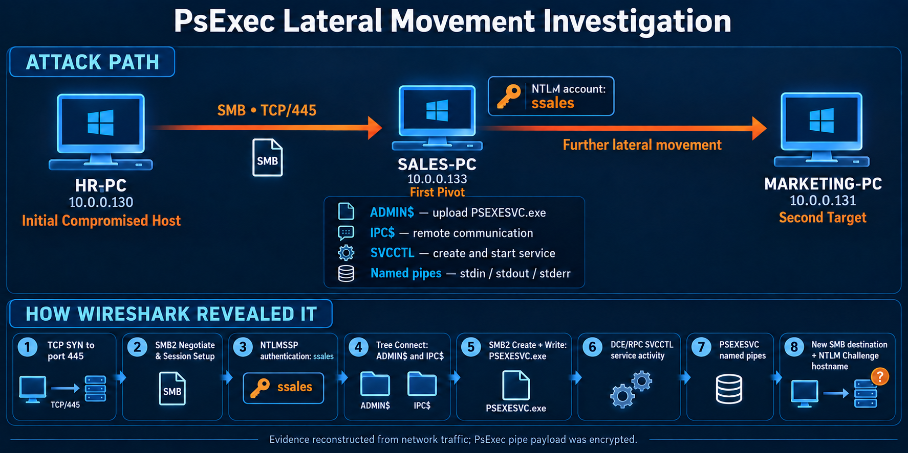

## Evidence and Tools

- **Evidence:** `psexec-hunt.pcapng`
- **Packet count:** `40,294`
- **Primary tool:** Wireshark
- **Primary protocols:** SMB2, NTLMSSP, DCE/RPC, and SVCCTL
- **Analysis focus:** authentication, administrative-share access, remote service deployment, named-pipe communication, and additional lateral movement

## Investigation Methodology

The investigation followed the evidence in chronological order:

1. Establish the dominant protocols and identify SMB conversations.
2. Isolate client-initiated SMB negotiation requests.
3. Inspect NTLM challenge and authentication messages to recover host and user identities.
4. Trace SMB Tree Connect, Create, Write, Read, and DCE/RPC operations inside the relevant IP conversation.
5. Correlate the executable transfer with service-control activity.
6. Search for later SMB connections from the same source and identify the next target by its NTLM challenge.

---

## 1. Initial Traffic Triage

Wireshark's **Protocol Hierarchy Statistics** showed that SMB2 dominated the capture. The PCAP contains `40,294` packets; SMB2 accounts for approximately `93.5%` of them. DCE/RPC and SVCCTL are also present, which is consistent with remote Windows service management.

Menu path:

```text
Statistics → Protocol Hierarchy
```

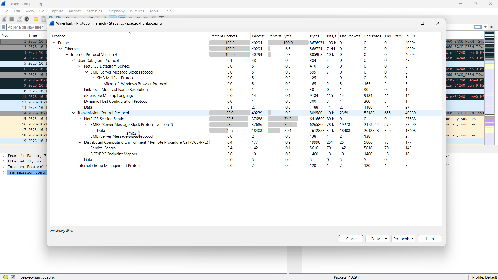

### Why this matters

Protocol hierarchy does not identify the attacker by itself. It tells us which protocol family deserves priority. In this capture, the combination of SMB2, DCE/RPC, and SVCCTL points toward Windows remote administration or lateral movement.

---

## 2. Q1 — Initial Source IP

To display only client-originated SMB2 negotiation requests:

```wireshark
smb2.cmd == 0 && smb2.flags.response == 0
```

- `smb2.cmd == 0` selects **SMB2 NEGOTIATE**.
- `smb2.flags.response == 0` removes server responses and keeps requests.
- In a request, the source is the machine initiating the SMB connection and the destination is the target.

The earliest relevant request was sent from `10.0.0.130` to `10.0.0.133` on TCP port `445`.

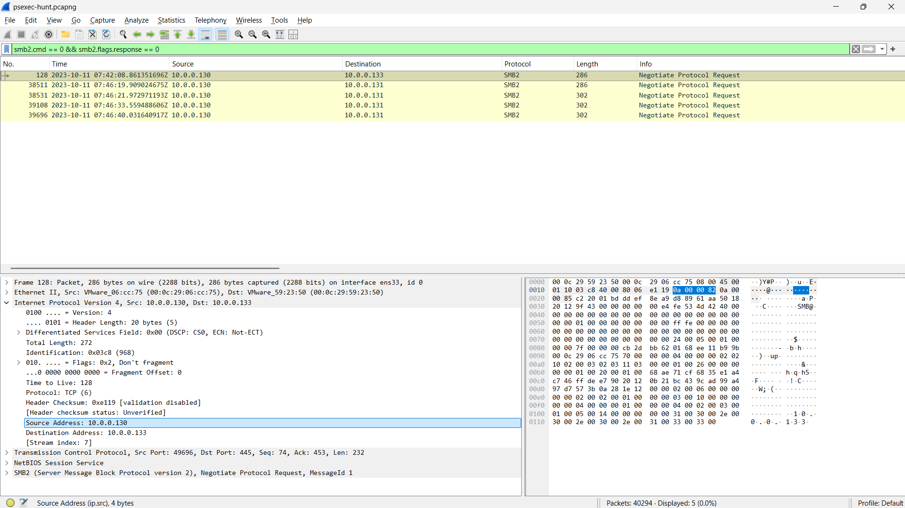

**Finding:** `10.0.0.130`

---

## 3. Q2 — First Pivot Hostname

The first SMB exchange belongs to IP conversation `7`. The filter uses `ip.stream`, not `tcp.stream`, because the stream index displayed in the IPv4 details is the IP conversation index.

```wireshark
ip.stream eq 7 && smb2.cmd == 1
```

`smb2.cmd == 1` selects **Session Setup**, where NTLM authentication messages are carried. In the server's `NTLMSSP_CHALLENGE`, expand:

```text
SMB2
└── Session Setup Response
    └── Security Blob
        └── NTLM Secure Service Provider
            └── Target Info
                └── NetBIOS computer name
```

The target identified itself as `SALES-PC`.

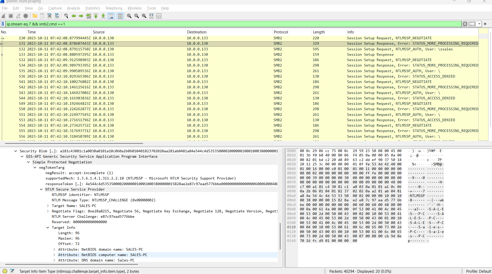

**Finding:** `SALES-PC`

---

## 4. Q3 — Account Used for Authentication

Keep the Session Setup filter and select the client `NTLMSSP_AUTH` message:

```wireshark
ip.stream eq 7 && smb2.cmd == 1
```

Expand:

```text
SMB2
└── Session Setup Request
    └── Security Blob
        └── NTLM Secure Service Provider
            ├── User name
            └── Host name
```

The authentication request shows:

- User name: `ssales`
- Client workstation: `HR-PC`
- Client IP: `10.0.0.130`
- Server IP: `10.0.0.133`

The fact that `10.0.0.130` sends this packet is expected: the client transmits the username and NTLM authentication response to the server. The password is not sent in plaintext.

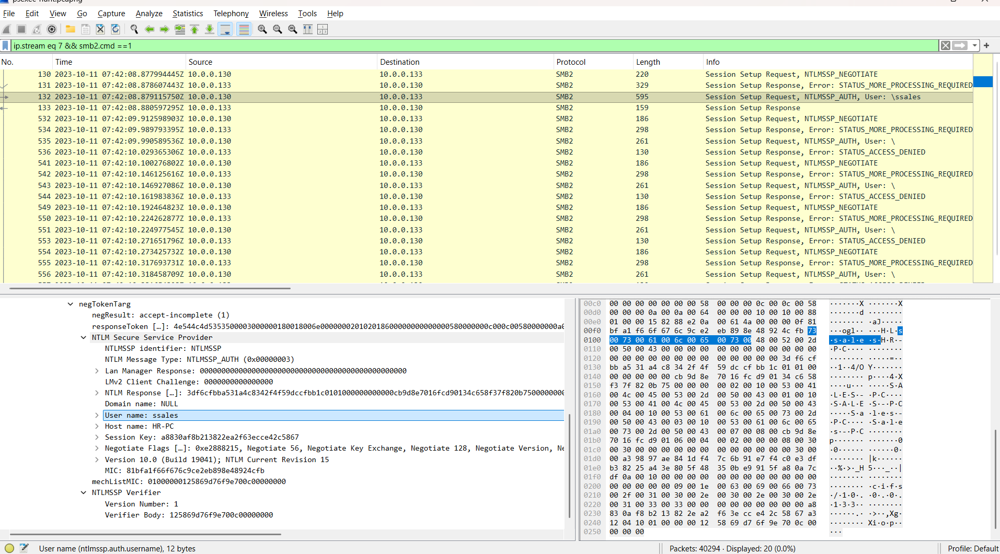

**Finding:** `ssales`

---

## 5. Q5 — Share Used to Install the Service

SMB2 command `3` is **TREE_CONNECT**, which requests access to a share:

```wireshark
ip.stream eq 7 && smb2.cmd == 3
```

The client connected to:

```text
\\10.0.0.133\ADMIN$
```

`ADMIN$` normally maps to the Windows directory and requires administrative privileges. PsExec uses it to place its temporary service executable on the remote host.

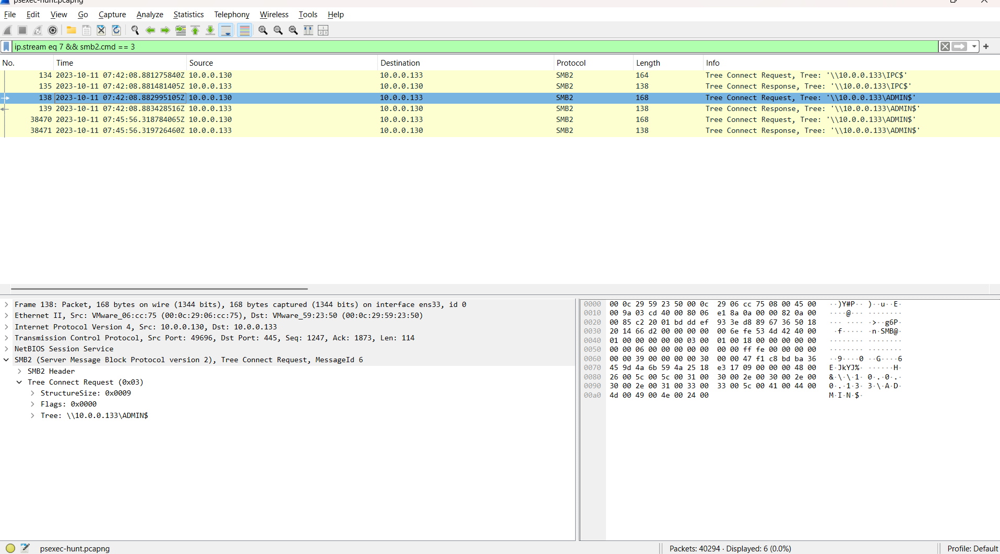

**Finding:** `ADMIN$`

---

## 6. Q6 — Share Used for Communication

The same Tree Connect filter also reveals access to:

```text
\\10.0.0.133\IPC$
```

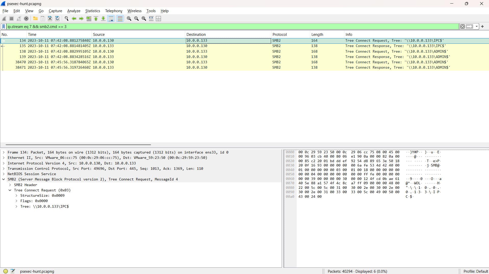

`IPC$` is used for inter-process communication, including access to RPC endpoints and named pipes. In this case, it supports PsExec's control and command-I/O channels.

**Finding:** `IPC$`

---

## 7. Q4 — PsExec Service Executable

SMB2 command `5` is **CREATE**. In SMB terminology, CREATE can open or create a file, directory, or named pipe.

```wireshark
ip.stream eq 7 && smb2.cmd == 5
```

The request shows the file:

```text
PSEXESVC.exe
```

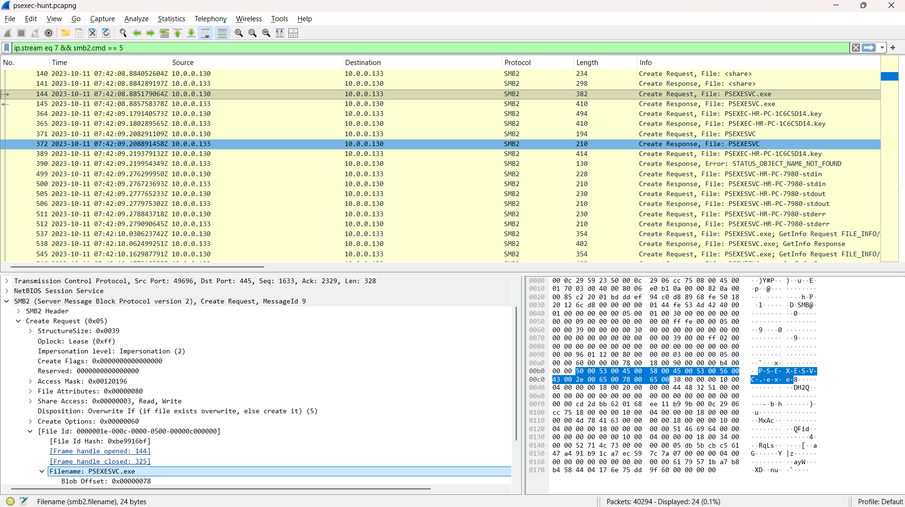

To confirm that the executable was actually transferred, isolate client Write requests:

```wireshark
ip.stream eq 7 && smb2.cmd == 9 && smb2.flags.response == 0
```

SMB2 command `9` is **WRITE**. The repeated writes to `PSEXESVC.exe`, including large data chunks, confirm that the file was copied to the target rather than merely queried.

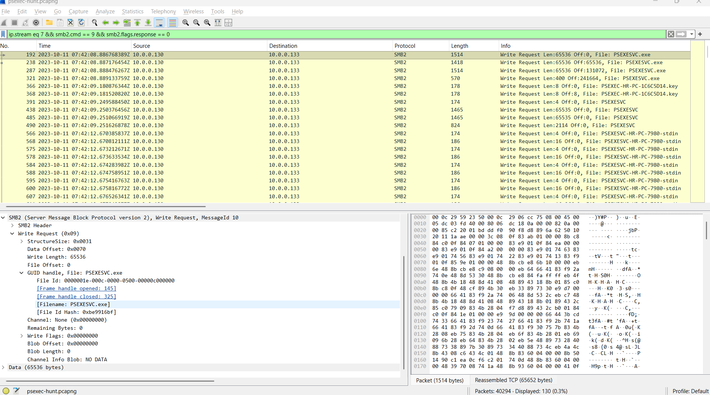

**Finding:** `PSEXESVC.exe`

> PsExec is a legitimate Microsoft Sysinternals administration utility. Its presence becomes security-relevant here because it is correlated with unauthorized lateral-movement behavior.

---

## 8. Remote Service Creation and Execution

After the executable transfer, DCE/RPC traffic exposes calls to the Windows Service Control Manager:

```wireshark
ip.stream eq 7 && dcerpc
```

The relevant SVCCTL sequence includes:

1. `OpenSCManager2`
2. `CreateServiceW`
3. `OpenServiceW`
4. `StartServiceW`
5. `QueryServiceStatus`

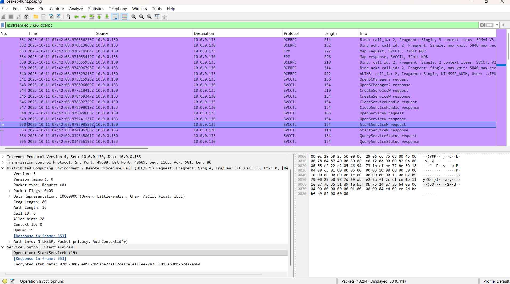

This sequence connects the transferred executable to remote execution. The executable was not simply stored on `SALES-PC`; it was installed and started as a Windows service.

---

## 9. PsExec Named-Pipe Communication

After service start, search for PsExec's named pipes:

```wireshark
ip.stream eq 7 && smb2.filename contains "PSEXESVC-"
```

The capture contains:

```text
PSEXESVC-HR-PC-7980-stdin
PSEXESVC-HR-PC-7980-stdout
PSEXESVC-HR-PC-7980-stderr
```

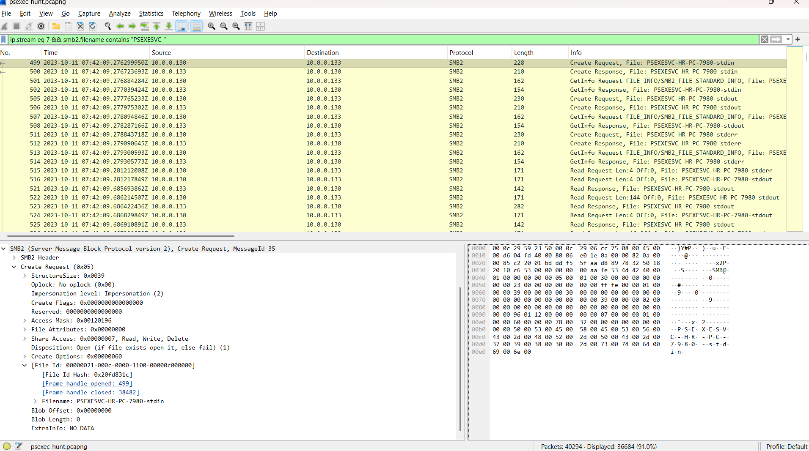

These pipes form the remote command channels:

| Pipe | Purpose |
|---|---|
| `stdin` | Sends operator input or command data to the remote process |
| `stdout` | Returns normal command output |
| `stderr` | Returns error output |

`HR-PC` in the pipe name identifies the initiating workstation. `7980` is the PsExec client process identifier used to make the pipe names unique.

The `stdout` data is present, but its bytes are not readable as plain command output in this capture:

```wireshark
ip.stream eq 7 && smb2.cmd == 8 &&
offset_length(smb2.file_data, 0, 144) &&
smb2.filename contains "stdout"
```

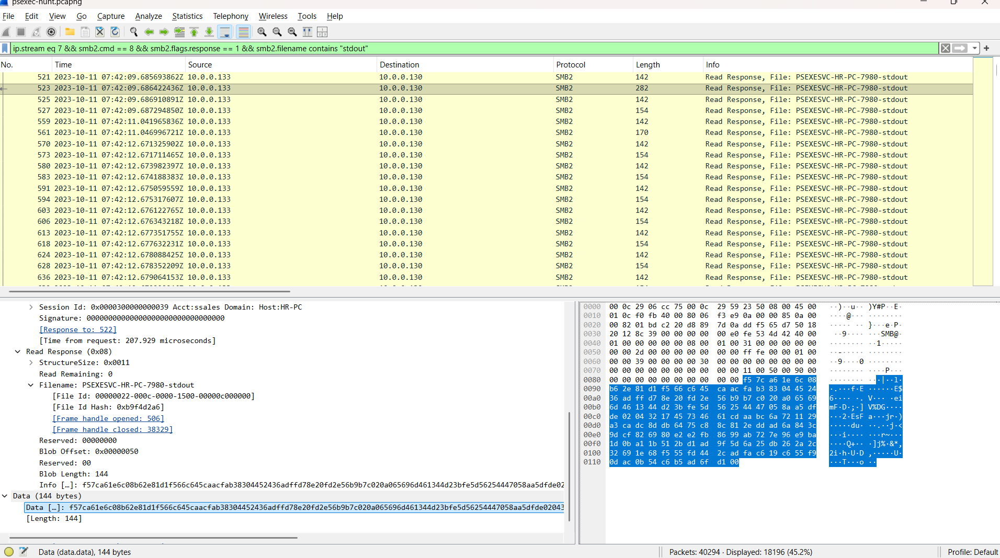

The defensible conclusion is that command output was exchanged through the pipe. The exact command or output cannot be recovered from this PCAP evidence alone.

---

## 10. Q7 — Second Lateral-Movement Target

To find new SMB sessions initiated by the same source, isolate initial TCP SYN packets to SMB:

```wireshark
ip.src == 10.0.0.130 &&
tcp.dstport == 445 &&
tcp.flags.syn == 1 &&
tcp.flags.ack == 0
```

The results show:

- First target: `10.0.0.133` at approximately `07:42:08 UTC`
- Second target: `10.0.0.131` beginning at approximately `07:46:19 UTC`

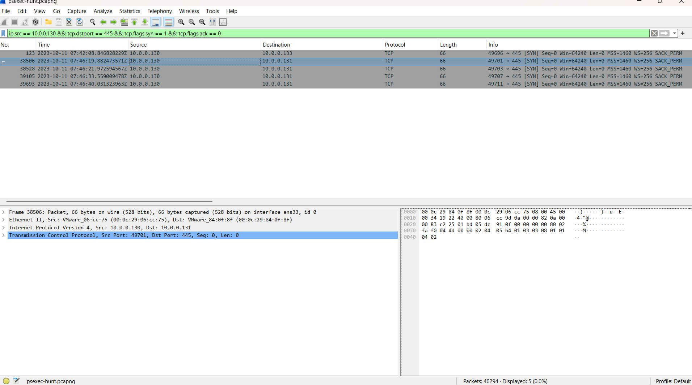

To identify the second host by name, inspect its NTLM challenge:

```wireshark
ip.src == 10.0.0.131 && ntlmssp.messagetype == 2
```

NTLMSSP message type `2` is the server challenge. Its Target Info identifies the server as `MARKETING-PC`.

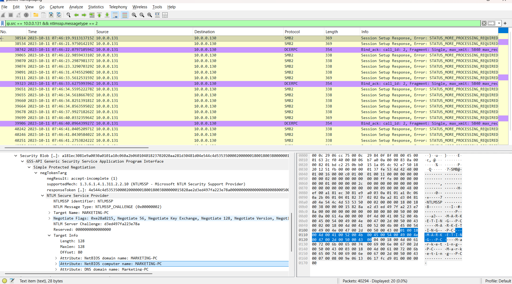

**Finding:** `MARKETING-PC`

---

## Reconstructed Attack Chain

1. `HR-PC` (`10.0.0.130`) initiated SMB to `SALES-PC` (`10.0.0.133`).
2. The client authenticated over NTLM using the account `ssales`.
3. It connected to `IPC$` and the administrative share `ADMIN$`.
4. `PSEXESVC.exe` was created and written to the target through SMB.
5. DCE/RPC SVCCTL calls created and started the remote service.
6. PsExec established `stdin`, `stdout`, and `stderr` named pipes for remote command communication.
7. The same source later initiated SMB connections to `10.0.0.131`.
8. The target's NTLM challenge identified it as `MARKETING-PC`.

## Timeline

| Time (UTC) | Source | Destination | Evidence |
|---|---|---|---|
| `2023-10-11 07:42:08` | `10.0.0.130` | `10.0.0.133` | Initial SMB connection and negotiation |
| `2023-10-11 07:42:08` | `HR-PC` | `SALES-PC` | NTLM authentication using `ssales` |
| `2023-10-11 07:42:08` | `HR-PC` | `SALES-PC` | Access to `IPC$` and `ADMIN$` |
| `2023-10-11 07:42:08` | `HR-PC` | `SALES-PC` | Transfer of `PSEXESVC.exe` |
| `2023-10-11 07:42:08` | `HR-PC` | `SALES-PC` | SVCCTL service creation and start |
| `2023-10-11 07:42:09` | `HR-PC` | `SALES-PC` | PsExec named-pipe communication |
| `2023-10-11 07:46:19` | `10.0.0.130` | `10.0.0.131` | New SMB connection to `MARKETING-PC` |

## Indicators of Compromise

| Type | Value |
|---|---|
| Source IP | `10.0.0.130` |
| Source hostname | `HR-PC` |
| First target IP | `10.0.0.133` |
| First target hostname | `SALES-PC` |
| Second target IP | `10.0.0.131` |
| Second target hostname | `MARKETING-PC` |
| User account | `ssales` |
| Executable | `PSEXESVC.exe` |
| Shares | `ADMIN$`, `IPC$` |
| Named-pipe prefix | `PSEXESVC-HR-PC-7980-` |
| Network service | SMB over `TCP/445` |

## MITRE ATT&CK Mapping

| Tactic | Technique | Evidence |
|---|---|---|
| Lateral Movement | `T1021.002 — SMB/Windows Admin Shares` | SMB authentication followed by `ADMIN$` and `IPC$` access |
| Lateral Movement | `T1570 — Lateral Tool Transfer` | Transfer of `PSEXESVC.exe` to the remote host |
| Execution | `T1569.002 — Service Execution` | SVCCTL `CreateServiceW` and `StartServiceW` calls |
| Defense Evasion / Persistence / Privilege Escalation / Initial Access | `T1078 — Valid Accounts` | The `ssales` account was used for successful NTLM authentication |

## Detection Opportunities

- Correlate successful NTLM logons with immediate `ADMIN$` or `IPC$` access.
- Alert on writes of `PSEXESVC.exe` or similarly named service binaries to administrative shares.
- Detect remote service creation shortly after an SMB file transfer.
- Monitor `svcctl` RPC calls such as `CreateServiceW` and `StartServiceW` from workstations.
- Alert on named pipes matching `PSEXESVC-*-(stdin|stdout|stderr)`.
- Correlate Windows events `4624`, `4672`, `5140`, `5145`, `4697`, and System event `7045`.
- Flag one workstation initiating SMB sessions to multiple peer workstations within a short time window.

## Remediation Recommendations

1. Isolate `HR-PC`, `SALES-PC`, and `MARKETING-PC` pending endpoint validation.
2. Reset the `ssales` credentials and review the account's group memberships and logon history.
3. Restrict SMB between workstation network segments.
4. Limit remote access to `ADMIN$` and `IPC$` to approved administrative systems.
5. Disable or tightly control NTLM where operationally possible.
6. Use host firewalls and network segmentation to restrict TCP/445.
7. Monitor and control PsExec and other dual-use remote-administration tools.
8. Hunt for the `PSEXESVC` service, executable remnants, and related named pipes.
9. Review service-creation and process-creation telemetry on both target hosts.
10. Determine how the initiating system or `ssales` credentials were originally compromised.

## Limitations

- The investigation is limited to the supplied PCAP and does not include endpoint, Active Directory, or EDR telemetry.
- NTLM proves that `ssales` was used; the PCAP alone does not prove how the credentials were obtained.
- The PsExec pipe data visible in the capture is opaque, so the exact remote command cannot be stated reliably.
- `PSEXESVC.exe` is dual-use; malicious intent is established through the complete unauthorized behavior chain, not by the filename alone.

## References

- [Microsoft Sysinternals — PsExec](https://learn.microsoft.com/en-us/sysinternals/downloads/psexec)
- [MITRE ATT&CK — PsExec (S0029)](https://attack.mitre.org/software/S0029/)
- [MITRE ATT&CK — SMB/Windows Admin Shares (T1021.002)](https://attack.mitre.org/techniques/T1021/002/)
- [MITRE ATT&CK — Service Execution (T1569.002)](https://attack.mitre.org/techniques/T1569/002/)
- [MITRE ATT&CK — Lateral Tool Transfer (T1570)](https://attack.mitre.org/techniques/T1570/)
- [MITRE ATT&CK — Valid Accounts (T1078)](https://attack.mitre.org/techniques/T1078/)

---

**Author:** Alaa Zahra  
**Track:** SOC Analyst Tier 1  
**Platform:** CyberDefenders

