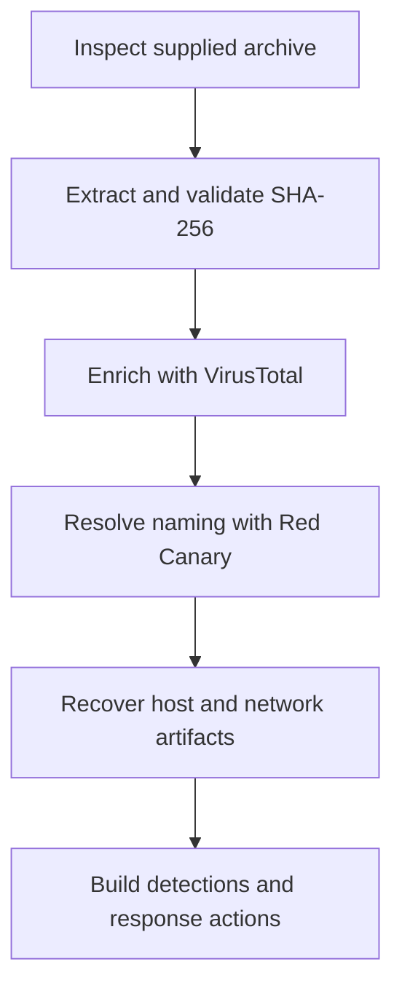
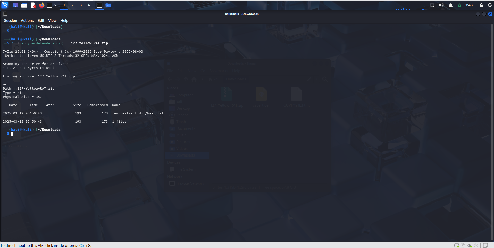
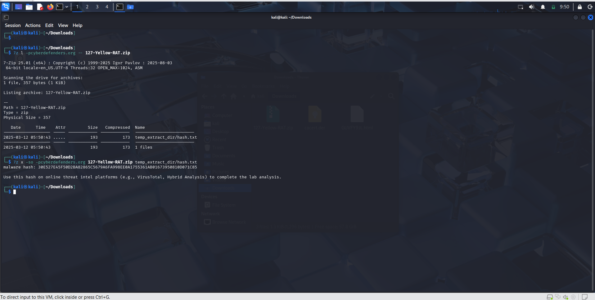
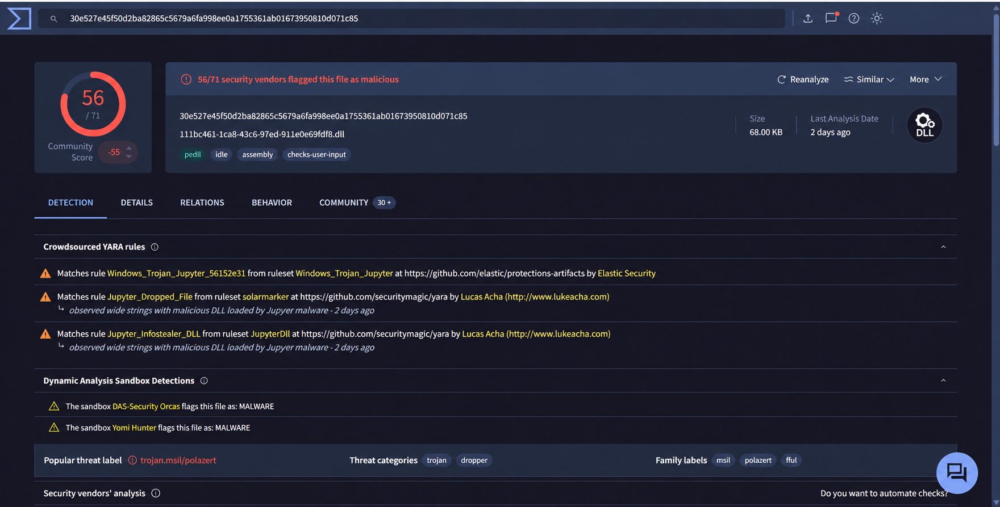
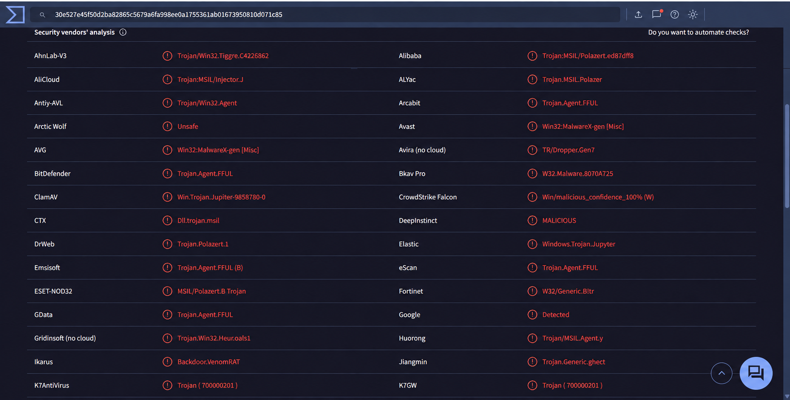
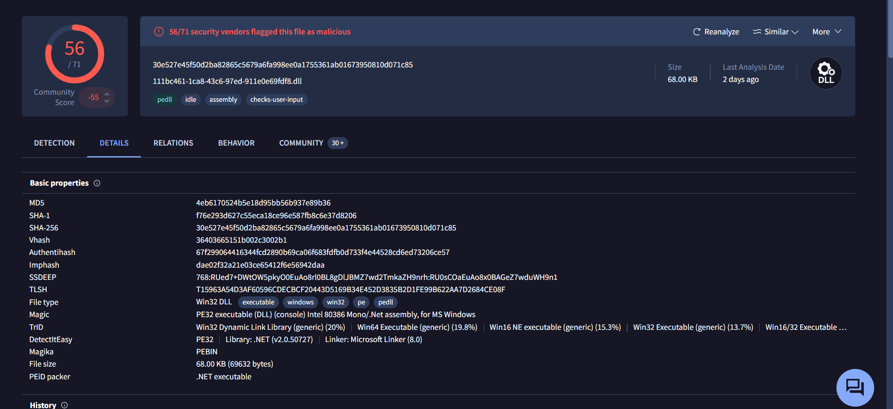
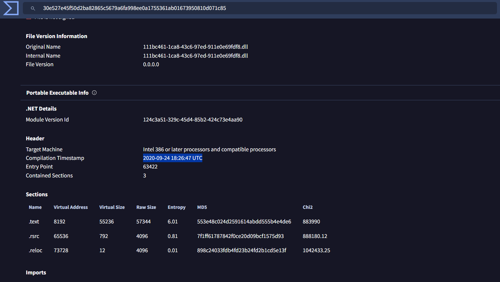
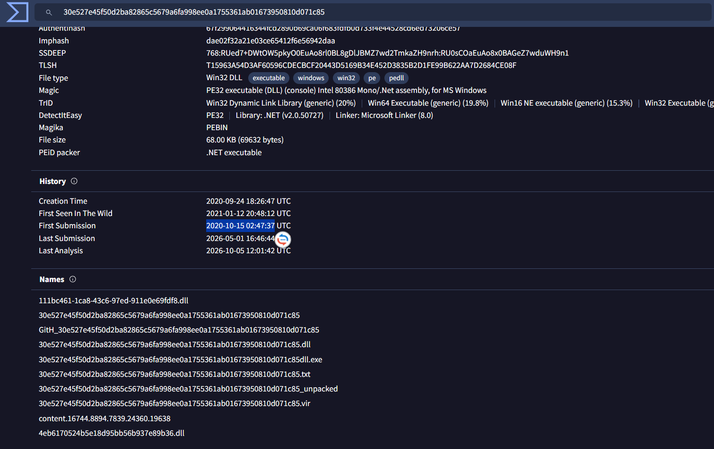
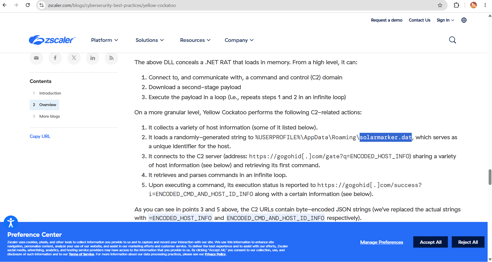
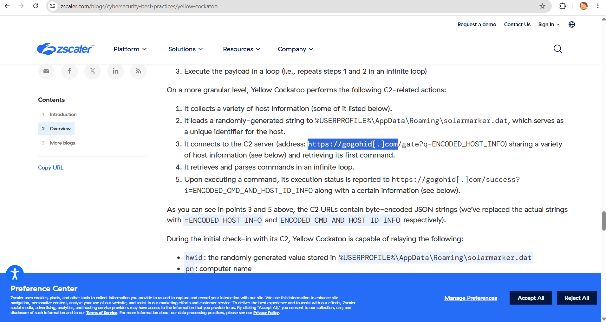

# Yellow RAT — Malware Intelligence Investigation


## Overview

This write-up documents a static malware-intelligence investigation that began with a single SHA-256 value supplied in a CyberDefenders evidence archive. The objective was to enrich that indicator, resolve inconsistent vendor naming, recover host and network artifacts, and turn the findings into practical detection and response actions.

No sample was executed. The investigation relied on the supplied hash, VirusTotal metadata, and the technical analysis published by Red Canary.

> All timestamps are presented in UTC. The C2 domain is defanged to prevent accidental navigation.

## Investigation Scope

| Item | Value |
|---|---|
| Evidence archive | `127-Yellow-RAT.zip` |
| Archive password | `cyberdefenders.org` |
| Supplied artifact | `temp_extract_dir/hash.txt` |
| Investigation type | Hash enrichment and open-source malware intelligence |
| Execution performed | No |

## Full Report

- [Download the DOCX investigation report](./YellowRAT-Malware-Intelligence-Investigation-Report.docx)
- [Download the PDF investigation report](./YellowRAT-Malware-Intelligence-Investigation-Report.pdf)

## Investigation Workflow



## 1. Evidence Triage

The archive was listed before extracting or opening any content. This confirmed that the lab contained a small text artifact rather than an executable sample. That distinction matters: the immediate task was indicator enrichment, not dynamic execution.

```bash
7z l 127-Yellow-RAT.zip -pcyberdefenders.org
```



*Figure 1 — The archive contains `temp_extract_dir/hash.txt`, establishing the evidence provided for analysis.*

The text file contained one 64-character hexadecimal value, which is the expected representation of a SHA-256 hash.

```bash
cat temp_extract_dir/hash.txt
```

```text
30e527e45f50d2ba82865c5679a6fa998ee0a1755361ab01673950810d071c85
```



*Figure 2 — The supplied SHA-256 used as the investigation pivot.*

## 2. VirusTotal Enrichment

Searching the SHA-256 in VirusTotal associated the indicator with a DLL sample and showed a strong malicious consensus at the time of analysis: 56 of 71 engines flagged it. A detection ratio is useful for prioritization, but it does not establish a single authoritative malware-family name.



*Figure 3 — VirusTotal overview for the supplied SHA-256, including the detection ratio and file type.*

Vendor labels differed across engines. This is expected because vendors use different clustering methods, naming rules, and update schedules. The correct response is to pivot to the source named by the question and verify its own technical reporting.



*Figure 4 — Multiple security vendors assign different labels to the same sample.*

## 3. Threat Cluster Attribution

Red Canary tracks the activity cluster as **Yellow Cockatoo**. This is a threat-cluster name, not proof of a real-world actor identity. Other vendors may use labels such as Jupyter or SolarMarker for overlapping activity.


*Figure 5 — Red Canary technical analysis identifying the Yellow Cockatoo threat cluster.*

## 4. File Metadata

VirusTotal listed the commonly associated filename as:

```text
111bc461-1ca8-43c6-97ed-911e0e69fdf8.dll
```

The filename is a useful hunting clue but is weaker than the hash because an attacker can rename a file without changing its contents.



*Figure 6 — VirusTotal file properties showing the associated DLL filename.*

The Portable Executable metadata showed a compilation timestamp of `2020-09-24 18:26:47 UTC`.



*Figure 7 — Compilation timestamp stored in the PE metadata.*

This value is a development clue, not an infection timestamp. PE timestamps can also be modified or forged.

VirusTotal recorded the first submission at `2020-10-15 02:47:37 UTC`, approximately 20 days after the compilation timestamp.



*Figure 8 — VirusTotal history showing when the sample was first submitted to the service.*

The submission time means “first seen by VirusTotal,” not “first executed in the victim environment.”

## 5. Host Artifact

The Red Canary analysis documented the following AppData artifact:

```text
%USERPROFILE%\AppData\Roaming\solarmarker.dat
```

The file stores a randomly generated unique host identifier used by the malware during C2 communication.



*Figure 9 — Technical analysis describing the creation and purpose of `solarmarker.dat`.*

## 6. Command and Control

The technical analysis associated the sample with the following C2 domain:

```text
gogohid[.]com
```

Observed paths included `/gate` for host information and command retrieval and `/success` for reporting execution results.



*Figure 10 — Red Canary analysis describing the defanged C2 domain and communication flow.*

## Key Findings

| Finding | Result | Evidence source |
|---|---|---|
| Threat cluster | `Yellow Cockatoo` | Red Canary technical analysis |
| SHA-256 | `30e527e45f50d2ba82865c5679a6fa998ee0a1755361ab01673950810d071c85` | Supplied evidence and VirusTotal |
| Common filename | `111bc461-1ca8-43c6-97ed-911e0e69fdf8.dll` | VirusTotal file properties |
| Compilation time | `2020-09-24 18:26:47 UTC` | VirusTotal PE metadata |
| First VirusTotal submission | `2020-10-15 02:47:37 UTC` | VirusTotal history |
| AppData artifact | `solarmarker.dat` | Red Canary technical analysis |
| C2 domain | `gogohid[.]com` | Red Canary technical analysis |

## Indicators of Compromise

| Type | Indicator | Confidence | Notes |
|---|---|---:|---|
| SHA-256 | `30e527e45f50d2ba82865c5679a6fa998ee0a1755361ab01673950810d071c85` | High | Strongest sample identifier in this investigation |
| Filename | `111bc461-1ca8-43c6-97ed-911e0e69fdf8.dll` | Medium | Renamable; correlate with hash and behavior |
| File path | `%APPDATA%\solarmarker.dat` | High | Documented host identifier artifact |
| Domain | `gogohid[.]com` | High | Historical C2 infrastructure; validate relevance before blocking |
| URI path | `/gate` | Medium | Check-in and command retrieval in the cited analysis |
| URI path | `/success` | Medium | Execution-status reporting in the cited analysis |

## MITRE ATT&CK Mapping

The following mappings describe behavior documented for the Yellow Cockatoo cluster. They should not be interpreted as proof that every technique occurred on a specific endpoint without supporting telemetry.

| Technique | ID | Rationale |
|---|---|---|
| Ingress Tool Transfer | T1105 | Downloads additional payloads |
| Application Layer Protocol Web Protocols | T1071.001 | Uses HTTPS for C2 communication |
| System Information Discovery | T1082 | Collects and sends host information |
| PowerShell | T1059.001 | Cluster reporting describes PowerShell-based execution |
| Process Hollowing | T1055.012 | The documented `rpe` command performs process hollowing |
| Registry Run Keys Startup Folder | T1547.001 | Cluster reporting describes Startup-folder shortcut persistence |

## Detection and Response Recommendations

1. Hunt for the SHA-256 across EDR, antivirus, file inventory, email, and download telemetry.
2. Search endpoints for `%APPDATA%\solarmarker.dat` and investigate its creation process and surrounding timeline.
3. Review DNS, proxy, firewall, and EDR network events for the defanged domain and related URI paths.
4. Treat the filename as supporting evidence only; correlate it with the hash, file path, signer, process tree, and network behavior.
5. Isolate confirmed affected hosts, preserve volatile evidence, and collect suspicious binaries for controlled analysis.
6. Inspect Startup folders and shortcut files for persistence consistent with the documented cluster behavior.
7. Block confirmed malicious infrastructure while considering that historical domains may later change ownership or status.

## Investigation Limitations

- The lab supplied a hash rather than the executable, so no local static disassembly or sandbox execution was performed.
- VirusTotal community and vendor labels are not authoritative attribution.
- VirusTotal behavior data did not expose every requested artifact for this sample.
- Hybrid Analysis restricted older searches for anonymous access, so the investigation pivoted to the authoritative Red Canary report.
- Compilation and first-submission timestamps do not establish the time of infection in a victim environment.

## Lessons Learned

- Start with the evidence type actually provided; do not assume a hash-only lab contains a runnable sample.
- Use the SHA-256 as the stable pivot, then separate metadata, attribution, host artifacts, and network indicators.
- Resolve naming conflicts by consulting the organization named in the question or the original technical report.
- Record what each source proves and avoid turning metadata into stronger conclusions than it supports.
- When one intelligence source lacks an artifact, pivot to another reputable source and document the limitation.

## References

- [VirusTotal sample report](https://www.virustotal.com/gui/file/30e527e45f50d2ba82865c5679a6fa998ee0a1755361ab01673950810d071c85)
- [Red Canary — Yellow Cockatoo](https://redcanary.com/blog/threat-intelligence/yellow-cockatoo/)
- [Zscaler-hosted Yellow Cockatoo technical analysis](https://www.zscaler.com/blogs/cybersecurity-best-practices/yellow-cockatoo)
- [MITRE ATT&CK Enterprise Matrix](https://attack.mitre.org/)

## Disclaimer

This investigation was completed in an authorized training environment. Indicators are included for defensive education and should be validated against current threat intelligence before operational use.

